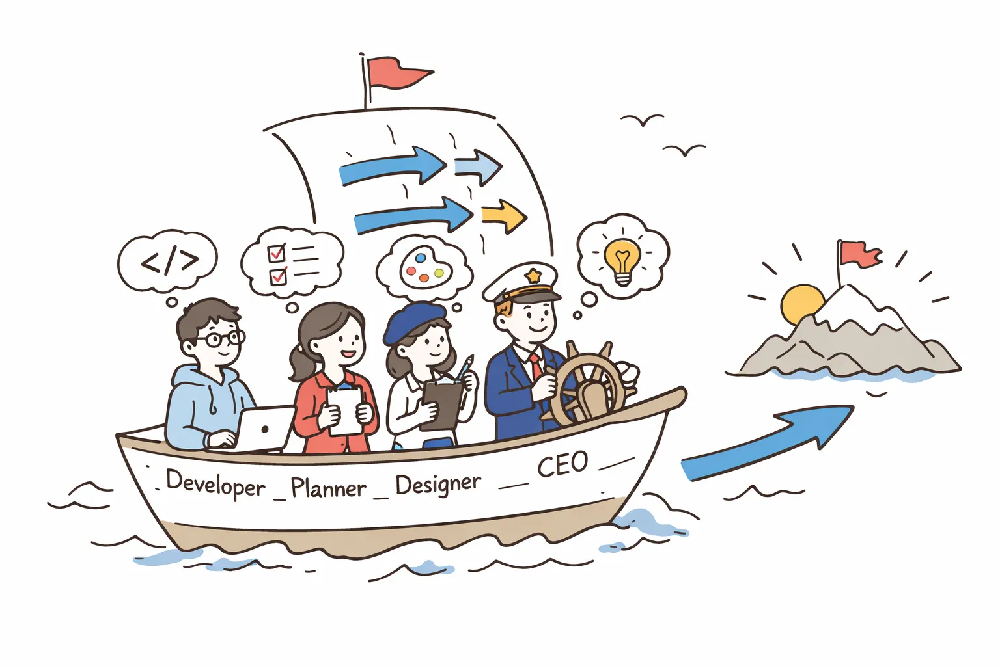

```
내가 생각하는 협업에 대해 기록하고자 한다.
사실 조직의 규모, 분위기, 지향하는 방식에 따라 달라질 수 있는 부분이라, 나의 개인적인 경험과 철학을 토대로 쓰는 점을 참고해주면 좋겠다.
```

내가 협업에서 가장 중요하다고 생각하는 것은 목표에 대한 동기화(Alignment)이다.

협업을 통해 지향하는 목표가 잘 공유되어 있어야 한다는 뜻이다. 반드시 하나의 뚜렷한 목적일 필요는 없다. 하지만 어떤 상황인지, 핵심적인 어려움은 무엇인지, 우리가 달성할 수 있는 목표는 무엇인지와 같은 것들이 공유되어 있어야 한다.

단순히 문장으로 “우리의 목표는 이것이다”라고 정의되어 있는 것과는 다르다. 그 이상으로, 상황과 맥락이 함께 공유되어 있는 것이 중요하다.

사람마다 생각이 다른 경우가 많다. 각자 포지션이나 성격의 차이, 이해관계에 따라 달라지기도 한다. 사람들이 같은 목표를 이야기하는 것처럼 보이지만, 디테일하게 보면 서로 다른 이야기를 하고 있는 경우가 많았다.

개발자는 잘 설계된 엔지니어링을 원하고, 디자이너는 미적으로 완성된 결과물을 본다. 경영자는 실질적인 성과로서의 개선을 원할 것이다. 기획자라면 마감 일정이나 프로젝트 성과를 중요시할 수도 있다. 내 경험상으로는 개발자 중에서도 성격이나 포지션에 따라 지향하는 목표가 달랐다.

나는 각자가 어떤 생각으로 일을 하고 있는지 민감하게 캐치하고, 그런 것들을 질문하거나 다시 한 번 짚어보면서 맞추는 역할을 종종 해왔던 것 같다.

실제 목표가 무엇인지도 중요하지만, 각 구성원이 이해하는 목표가 다르면 결국 합이 맞춰지지 않는다. 개인의 지향과 팀의 지향이 다를 수 있다는 것을 이해하고 맞춰나가는 것도 협업을 위한 태도라고 생각한다.

나는 작은 조직에서 주로 일을 해왔는데, 작은 조직에서는 각 담당자가 무엇을 하고 있는지 비교적 쉽게 알 수 있다. 어깨너머로 관찰하거나, 평소 대화를 통해 자연스럽게 파악할 수 있기 때문이다.

조금 더 큰 조직에서는 이런 것들이 쉽지 않아진다. 조직 간의 문제로 이어지기도 하고, 직접 소통하지 않는 사람의 의도까지 파악해야 하기 때문에 어려워진다. 현실적으로는 “그냥 이렇게 해야 하니까” 혹은 “상사가 그렇게 하라고 해서”라고 말하는 경우도 많아질 것 같다.

내가 큰 조직에서 일하게 된다면, 우선 내가 속한 팀 단위에서 어떤 목적과 목표를 가지고 있는지 먼저 이해하고 행동할 것 같다. 그리고 동시에 전사적인 목표와 방향성에 대해서도 이해하려고 노력할 것이다. 점차 기회가 된다면 전사적 측면의 목표를 고려하여 질문하고 제안하면서 팀의 방향에 대해서도 기여하게 될 것이다.

조직 문화를 잘 가꾸는 기업이라면 목표에 대한 동기화도 잘 이루어지고 있을 것이라고 생각한다. 그것이 좋은 조직의 모습이 아닐까 싶다. 10명 미만의 조직에서는 문제가 없다가도, 20명, 30명, 50명으로 성장하면서 생각처럼 잘 되지 않는 경우가 많고, 이에 대해 리더들의 고민도 많을 것 같다.

결국 본질적으로는 비슷한 문제를 겪는 것이 아닐까 생각하면서도, 조직마다 상황이 다르기 때문에 단순한 생각만으로는 다 이해할 수 없다고 느낀다. 기회가 된다면 이런 고민을 하는 사람들의 이야기를 더 들어보고 싶다.
