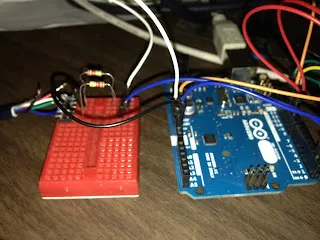
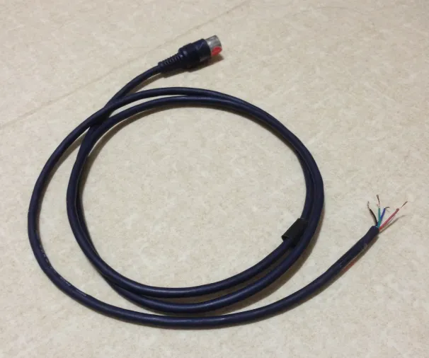
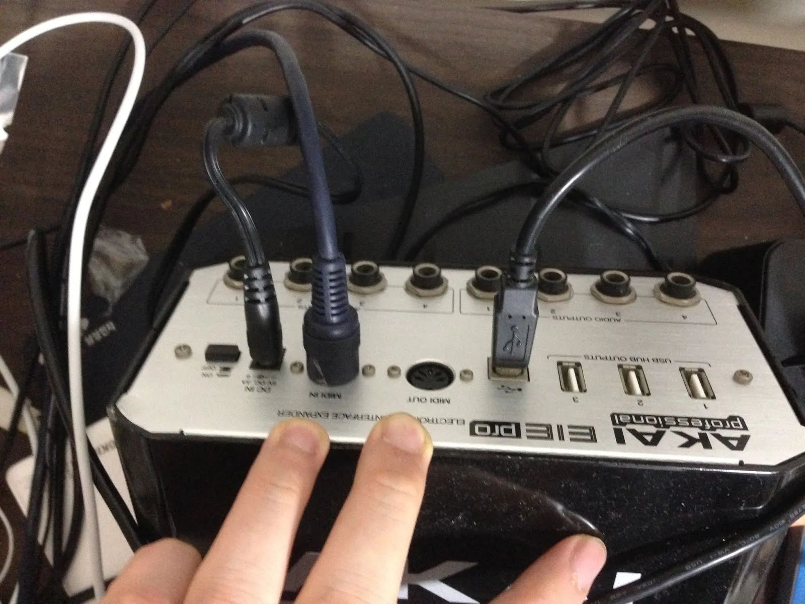
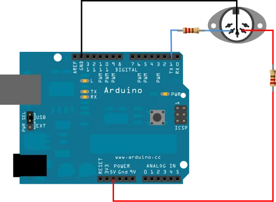
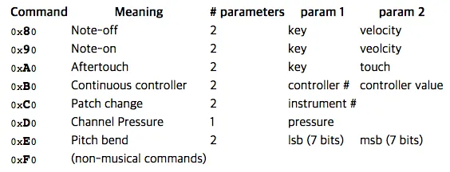

{width="100%" height="auto"}

아두이노로 미디(MIDI)신호를 출력하고 싶은데  
USB를 통한 Serial 방식으로는 불가능한것은 아니지만 간단한 방법이 따로 없는것 같아서요.

MIDI케이블을 하나 잘라서 아두이노에 연결해버렸습니다.

싹둑....





MIDI신호를 직접 출력하기 때문에 MIDI신호를 받을 수 있는 인터페이스가 따로 필요합니다.  
다행히 오디오 인터페이스에 MIDI in/out단자가 같이 있어서 MIDI신호를 받는데에는 문제가 없었네요.



Arduino 공식사이트에 있는 MIDI튜토리얼을 참고해서만들었습니다.

먼저 위 그림과 같이 미디 케이블과 아두이노를 연결하고 적당한 미디신호를 출력하도록 코드를 넣었습니다.

공식사이트의 레퍼런스를 보면 아래와같이 noteOn이라는 함수를 만들어놓고 실행하도록 되어있습니다.

```cpp
// plays a MIDI note. Doesn't check to see that
// cmd is greater than 127, or that data values are less than 127:
void noteOn(int cmd, int pitch, int velocity) {
    Serial.write(cmd);
    Serial.write(pitch);
    Serial.write(velocity);
}
```

이런식으로 noteOn의 첫 번째 입력변수로 **0x90**를 쓰면 noteOn이 되는데요,

키를 누를 때, noteOn(**0x90**, 0x4A ,0x45)가 실행되도록 하면 **0x4A**에 해당하는 음을 출력합니다.



구글링을 통해 MIDI신호의 체계에 대한 자료도 조금 긁어 모았습니다.

noteOn의 첫 번째 입력변수(cmd)로 0x90를 쓰면 note on이 된다고 하는데요.

아두이노 예제에는 없지만 위 표를 참조하여 0x90대신 0x80을 쓰면 note off가 됩니다.

note on을 시켰다가, note off를 시키면 재생되던 음이 중지됩니다.

(참고: 숫자에 0x가 붙은 것은 그 수가 16진수라는 표시입니다.)

키를 누를때는 note on명령을 주고, 키를 뗄 때는 note off명령을 주면 더욱 리얼한 연주를 만들수 있습니다.

아, 그리고 추가로 이것은 정확하게 확인된 것은 아닌데요.  
noteOff라고 할지라도 velocity가 0이 아닌 값을 넣어야 정상적으로 off가 되는 것 같네요.

### 참고 자료:

- [Arduino MIDI Tutorial](https://www.arduino.cc/en/Tutorial/Midi)
- [Linux MIDI Documentation](https://ccrma.stanford.edu/~craig/articles/linuxmidi/misc/essenmidi.html)

원문: [https://randomflik.blogspot.com/2016/09/arduinomidi.html](https://randomflik.blogspot.com/2016/09/arduinomidi.html)
