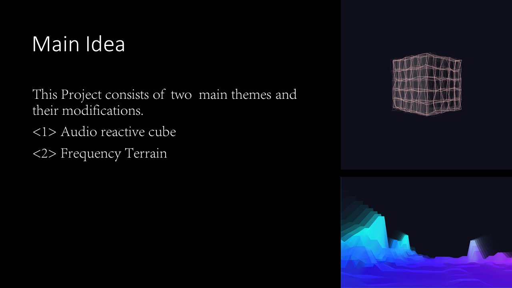
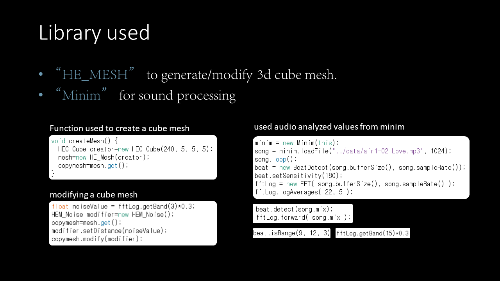
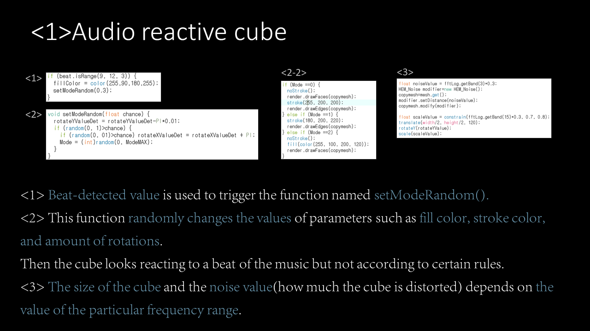
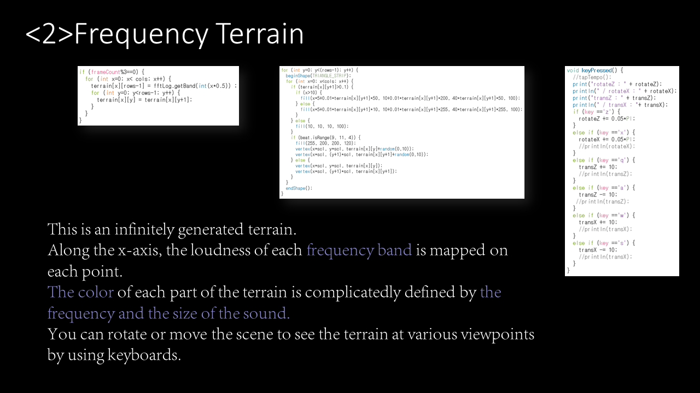
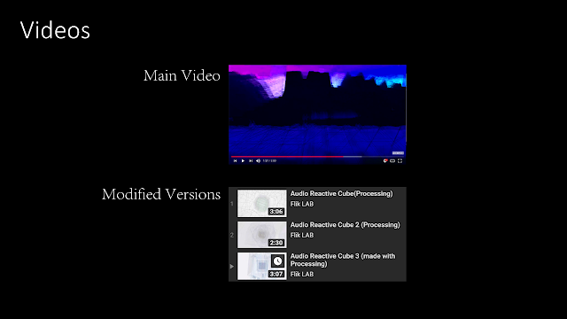

Processing을 사용하여 오디오에 반응하는 시각화를 어떻게 만들었는지 공유합니다.

## Main Idea

This Project consists of two main themes and their modifications.

- **<1> Audio Reactive Cube**
- **<2> Frequency Terrain**

## <1>Audio reactive cube

<1> Beat-detected value is used to trigger the function named `setModeRandom()`.
<2> This function randomly changes the values of parameters such as fill color, stroke color, and amount of rotations.
Then the cube looks reacting to a beat of the music but not according to certain rules.
<3> The size of the cube and the noise value(how much the cube is distorted) depends on the value of the particular frequency range.

## Libraries

## <2>Frequency Terrain

This is an infinitely generated terrain.
Along the x-axis, the loudness of each frequency band is mapped on each point. The color of each part of the terrain is complicatedly defined by the trequency and the size of the sound
You can rotate or move the scene to see the terrain at various viewpoints
by using keyboards.

관심 가져주셔서 감사합니다.
질문이 있으시다면 언제든 알려주세요.

<iframe width="560" height="315" src="https://www.youtube.com/embed/LPduVX1qKGk" title="YouTube video player" frameborder="0" allow="accelerometer; autoplay; clipboard-write; encrypted-media; gyroscope; picture-in-picture" allowfullscreen></iframe>

<iframe width="560" height="315" src="https://www.youtube.com/embed/dGAdpjFcTgQ" title="YouTube video player" frameborder="0" allow="accelerometer; autoplay; clipboard-write; encrypted-media; gyroscope; picture-in-picture" allowfullscreen></iframe>

원문: [How I made Audio Reactive Visual with Processing](https://randomflik.blogspot.com/2017/12/how-i-made-audio-reactive-visual-with.html)
