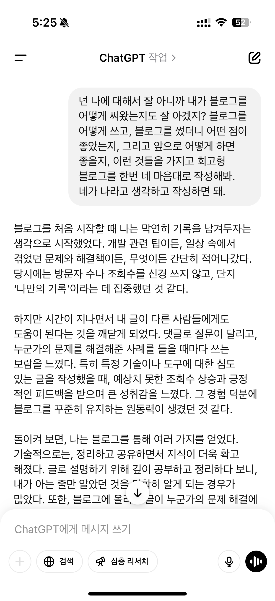

> 이 포스팅에서 하는 이야기들은 일반화된 결론이 아닌 그저 저의 경험과, 경험을 토대로 한 생각과 통찰들일 뿐입니다. 정확한 통계 자료를 근거로 제공하지 않습니다. 억지로 통계에 끼워맞추기보다는 이 모든 것이 저의 경험과 생각에 따른 이야기임을 밝힙니다. 생각을 기록할겸, 읽는 이에게는 새로운 통찰이 되기를 바라며 글을 작성했습니다.

## 블로그의 가치

되돌아 생각해보니 나에게 블로그라는 건 오랫동안 여러가지 방식으로 존재해왔다.  
네이버 블로그, 이글루스, Blogger(구글 블로그), 티스토리, github.io 블로그, Next.js로 만든 Techbukket블로그와 Astro로 만들어 직접 배포하고 있는 이 블로그까지.

장소는 바뀌었지만, 나에게 블로그란 늘 무언가를 남기면서, 이를 통해 회고하고 성장하기도 하고, 정보를 공유하는 뿌듯함을 느끼기도 했던 것 같다.

많은 이들에게 블로그란 나와 비슷한 가치를 가지는 공간이었을 것이다.

그러던 중 어느날 ChatGPT, Claude같은 LLM이 나타나면서 이 생태계는 파괴되었다.

## AI가 글 써주는 시대가 정말 왔다

내가 활동하고 있는 어떤 오픈카톡방에는 블로그로 부수입을 올리는 분들이 많다.  
LLM이 등장하기 전부터 셀레늄이나 API 등을 활용해서 블로그 글을 자동으로 올리는 방법을 활용해서 수익화를 실현한 고수분들도 계시다.

그런데 LLM이 등장하고 나서 채팅방에서는 LLM이라는 엄청난 도구를 활용해서 더 엄청난 자동화를 이루어내는 분들이 점점 많아졌고, 반응이 아주 뜨거웠다.

실제로 구글 검색을 통해 검색하는 글들의 상당수가 AI가 작성했다는 흔적이 보인다.

## 남들 다 하는데, 나도 시켜보자

그런 흐름 속에서 한번 따라 해보기로 하는데.
당시에 나는 두가지 방법으로 진행한다.

**<1> AI의 도움을 받아서 사람이 마무리하는 글**

- 글의 퀄리티 준수, 유익한 글이 될 수 있도록 함.
- 뚜렷하고 좁은 분야의 글 주제
- 글 하나 쓰는데 시간이 오래 걸림

**<2> AI가 쓴 글의 90% 이상을 그대로 올리는 블로그**

- 쓰레기글이라도 그냥 올린다.
- 최대한 많은 주제, 다양한 주제로 올린다.
- 글 하나 쓰는데 얼마 안걸림.

<1>을 통해서는 흔히 '전문블로그' 라는 분야의 SEO를 최대한 잘 했을 때 얼마나 잘 되는지를 검증하고 싶었고, <2>를 통해선 AI가 쓴 글이 얼마나 잘 먹히는지 궁금했고, 잘 먹힌다면 최대한 어떤 분야에서 어떤 트래픽이 발생하는지 내 눈으로 보는 경험을 하고 싶었다.

## AI로 글 써보니까?

결론부터 말하자면… **사람이 쓴게 훨씬 노출이 잘된다.**

이 실험을 해보기 전에는 사람이 보았을때 영혼 없는 글이라도 테크니컬 SEO를 잘 해놓으면, 검색엔진은 모르고 노출시켜줄 수도 있다고 생각했다.

그런데 검색엔진이 이걸 알고 해주는지는 몰라도 사람의 손을 건드리지 않고 AI만 가지고 글을 썼을 때에는 노출이 잘 되지 않았다.

사람의 손을 통해 제목이나 글 구성을 조금이라도 건드리는 것이 노출을 보장해주는 것은 아니지만, AI가 써준 글을 그대로 올렸을 때에는 노출이 아예 잘 되지 않는 경우가 많았다.

(여전히 이 분야에 대해서는 많은 사람들이 시도하고 있고, 내가 시도를 멈춘 이후로 LLM에도 많은 발전이 지속되고 있어서 이미 이루어낸 분도 있을거라고 생각한다)

### AI가 썼다는 걸 들킨걸까?

**AI가 썼다는 걸 들킨걸까?**

구글이 LLM이 쓴 글과 사람의 쓴 글을 가려낸다는 이야기도 있는데, 내 생각에 그건 중요한 요소는 아닌것 같다.
(구글 검색센터에 게재된 [게리 일리스의 글](https://developers.google.com/search/blog/2024/12/crawling-out-of-december?hl=ko)을 보면 LLM이 쓴 글의 영향을 인지하고 있긴 있는 것 같다만 구체적인 내용은 없다)

AI 글을 판별하는 기술을 아직 신뢰할 수 없기 때문이기도 하지만, 
**글을 AI가 썼냐 사람이 썼냐의 여부**를 판별하는 것보다 더 중요한 가치가 있다고 생각하기 때문이다.

### 중요한 것은 유저에게 유익한 콘텐츠

내 생각에 더 중요한 것은, "유저에게 유익한 콘텐츠"이다.

초기 노출 단계에서 사람들의 클릭률, 체류시간 등을 통해 콘텐츠의 유용성을 평가하는 식의 시스템이 이미 있고 AI로 쓴 글은 여기에서 효과적으로 점수를 얻지 못하는 경우가 많을거라는 생각이다.

실제로 [구글 검색 문서](https://developers.google.com/search/docs/fundamentals/creating-helpful-content?hl=ko)를 보면 유용하고 신뢰할 수 있는 콘텐츠를 우선으로 표시하기 위해 설계되었다고 밝히고 있다. 유튜브에서는 이미 이렇게 평가된다는 것을 많은 유튜버들이 알고 있다.

## 어떤 콘텐츠가 효과적일까?

내가 경험한 효과적인 콘텐츠를 되돌아보면 단순히 AI의 사용 여부와는 크게 관련은 없었다. 글을 잘 쓰고 못쓰는 문제도 아니었다.

이글의 흐름과는 무관한 이야기이긴 하지만 읽는 이들에게 궁금한 내용일 것 같아서 써 본다.

### 1. **아직 많이 다루어지지 않은 주제**

내 경험으로는 이게 가장 큰 영향을 주는 요소였다.

그럼 그런 주제를 어떻게 찾을까? 가장 흔히 알려진 것은 **키워드 분석 툴**을 사용하는 것이지만 나의 간단한 팁을 남기자면 키워드 툴보다 더 강력한게 있다. 키워드 툴에서 나오는 주제들은 내가 다루려고 하면 타이밍이 좀 늦은 경우가 많아서 후발주자로 참여하게 되는 경우가 많았다.

**어디선가 그 주제를 들었다면, 이미 다루어진 것이다.**

나를 선발주자로 만들어준 키워드는, 스스로 읽거나 해보면서 스쳐지나가는 주제들, 혹은 지인이 이야기하는 주제에서 나왔다. 이들의 공통점은 사람들이 궁금해할 가능성이 높지만 아직 많이 다루어지지 않았다는 것이다.

### 2. **사람들이 진짜로, 궁금해하는 주제**

가장 반응이 좋았던 포스팅으로 "기후동행카드"에 대한 글을 몇개 올린 적이 있다.

기후동행카드가 출시되기 직전에 사람들이 궁금해할만한 내용을 미리 예측해서 다음과 같은 주제를 선제적으로 올렸습니다:

- 기후동행카드 앱으로 쓰는법
- 기후동행카드로 따릉이 타는법
- 기후동행카드 사용 가능한 노선

이런 주제들은 사람이 보았을때는 당연해 보이지만, AI는 뚜렷하게 궁금해하는 것을 모른다.
AI를 통해 "ㅇㅇ와 관련해서 사람들이 궁금해하는 주제"를 뽑아달라고 할 수 있지만,
아직까지는 직접 쓸만한게 나오기보다는 브레인 스토밍을 도와주는 도구 정도로만 쓰는게 좋다.

이렇게 주제를 선정하는것도 중요하지만 사람들이 읽었을 때 자연스러운 표현을 사용하는 것도 중요하다.

### 3. **흡수율이 높은 표현**

(흡수율은 내가 만든 개념이다. 가독성이라는 표현도 있지만 미묘하게 다르다.)

사람은 문장의 미묘한 차이로도 흡수하는데 차이를 느낀다.
그 차이가 평소에는 느끼기 어렵지만 AI가 쓴 글은 이상하게 흡수율이 낮다.

흡수율이 낮은 문장은 다음과 같은 특징이 있습니다:

- 비유가 이상하거나
- 너무 과장되거나
- 잘 쓰지 않는 표현 등

보기 불편한 비유, 제목, 구조 등을 방치했을 때는 노출이 거의 안되었고,
그런걸 고쳤을 때 노출이 더 많이 되는 경우가 많았다.

### 4. 검색엔진 최적화, 아니 AI 최적화

아직까지 SEO는 중요하긴하지만, SEO는 다른 곳에서 많이 이야기하니 다른 이야기를 해보려고 한다.

어떤 사이트에 유입되는 방법은 지금까지 검색엔진이 높은 비중을 차지했지만, 이제 LLM 서비스의 출처를 통해 유입되는 비중이 점점 늘어나고 있다. 이렇게 SEO대신 LLM에 최적화하는 것을 AEO라고 부른다.

아직까지 AEO에 대한 공신력 있는 가이드는 없다. SEO와 크게 차이가 없을지도 모르지만, 그래도 AEO가 널리 퍼질수록 새로운 방식의 최적화가 될 것이다.

AEO의 작동 방식을 한마디로 하면, '유저의 질문에 대해 답할 수 있는 정보를 제공'한다는 것이다.
때문에 사용자가 어떤 질문을 할지가 우선 중요한 요소가 될 것이다. 그리고 그 질문에 대한 정보를 담고 있다는 것을 크롤링되기 쉽게, 검색되기 쉽게 나타나 있어야 할 것이다.

이런것을 의식해서 유입을 목표로 하는 블로그 포스팅을 작성할 때는 제목이나 글의 첫 머리를 질문으로 시작해보고 있다. 예를 들면 이렇게.

- "AEO가 무슨 뜻이에요?"
- "AEO를 왜 해야 하나요?"
- "AEO를 잘 하는 방법은 뭘까요?"

**Bing의 웹마스터 도구**를 사용하면 사람들이 어떤 질문을 통해 유입되는지 쉽게 알 수 있다.
구글, 네이버 웹마스터 도구에서는 키워드를 통한 유입이 많지만 Bing에는 질문형태의 키워드가 많다.

**OpenAI, Perplexity, Anthropic 등**의 LLM 서비스 측에서도 이런 웹마스터 도구를 지원할 날이 곧 올 것이라고 예측해볼 수 있고, 본격적인 AEO의 시대가 열리게 될 것 같다.

### AI의 가치 활용하기

AI가 쓴 글이 별로라고 해서, AI를 완전히 배제할 필요는 없다.

AI를 글쓰기에 적극적으로 활용해보니 이 도구를 적극적으로 활용하면서 얻는 장점을 알 수 있었다.

- **실행력의 허들을 낮춰줌(👍)**
- **글쓰기 주제를 정하는 허들 낮춰줌**
- **글쓰기 실력 허들도 낮춰줌**

나에게는 **의지력의 허들을 낮춰준다**는 점이 가장 컸다.
글 하나 쓰는게 생각보다 많은 시간과 에너지를 필요로 하기에 자칫하면 실행하지 못하게 된다.
또한 꾸준히 하지 않으면 결국 무너지게 되는데, AI라는 도구를 활용하면서 극복할 수 있었다.

나는 꾸준한 실행력을 가진 편이 아니지만, 글 하나 쓰는 시간을 많이 줄일 수 있어서
중간에 쉬는 텀이 있긴 하지만 꽤 오랜 시간 글쓰기에 집중할 수 있게 된 것 같다.

---

## 글 안 쓰는 시대

가까운 미래에는 글을 안쓰는 시대가 될 것 같다.

원래 글을 쓰는 것은 커뮤니티에 기여하는 일이었다. 원서를 번역하거나, 방대한 내용을 정리해서 책을 쓴다거나… 그런 게 인정받는 일이었고, 글을 쓰면서 생각을 정리하고 성장의 계기가 되기도 했다.

근데 이제는 AI가 다 해준다고 한다. "그거? 굳이 너가 안 해도 돼~"

그 말을 듣는 순간, 쓰기 싫어진다.

원래 인간은 가치 없는 일은 하지 않는 존재이기 때문이다.  
직접 사냥하지 않아도 되면, 더이상 직접 사냥하지 않는다.

지금의 인간들이 건강을 유지 위해 몸을 움직이는 것처럼,
먼 미래에는 생각하지 않는 멍청이가 되지 않기 위한 뇌 운동의 일환으로 글을 쓸지도 모른다.

---

### 사람의 글이 귀한 시대

그래서 사람의 글은 가치가 없을까?
다행히 그건 아니라고 생각한다.

먼 미래에는 모르겠지만 당분간은 '사람이 쓴 글'이 점점 더 **귀한 가치**를 가지게 될 것이다.

지금까지는 군더더기 없이 깔끔하게 쓴 글이 가치가 있었다면,
지금은 AI가 뽑아낸 쓰레기글이 많아지는 시대가 되어서
사람이 쓴 글은 오히려 반짝이는 느낌이다.

특히 실제로 느낀 **감정, 관찰, 경험, 살아있는 생각들**은 AI가 흉내낼 수 없기 때문에
오히려 글쓰기 실력이 부족하더라도 사람이 실제로 쓴 글이라면 훨씬 가치를 가질 것이다.

그래서 나도 이왕 글을 쓸거면 **감정, 관찰, 경험, 생각, 의견**을 담으려고 한다.

관련된 글: [사람의 글이 귀한 시대](https://flikary.dev/blog/human-writing)
