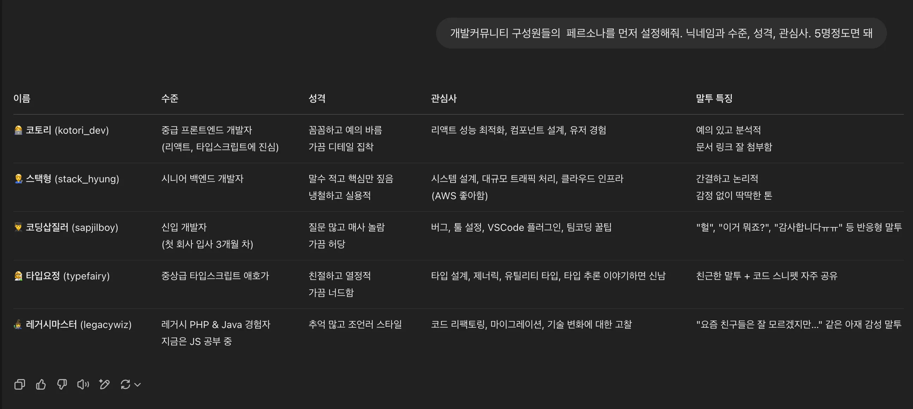
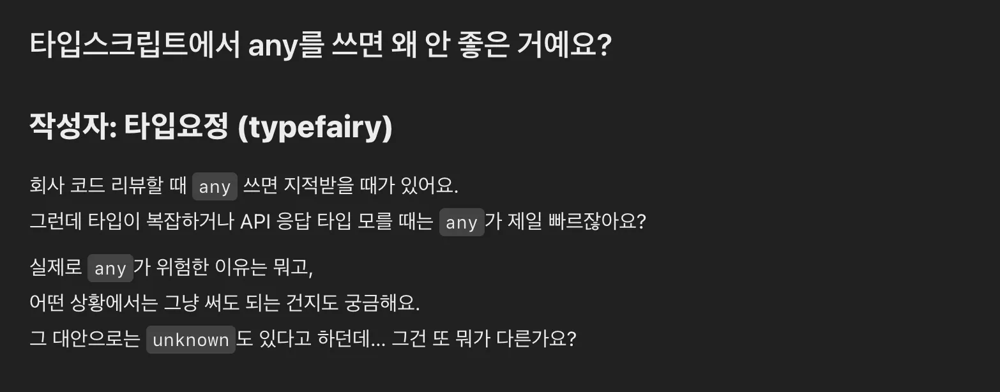
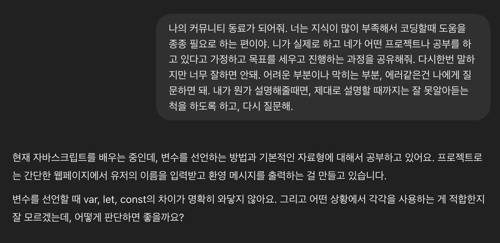

```
주의: 이 글은 매우 의식의 흐름에 따라 전개된다.
사실 여러 번 재구성한 것이긴 하지만, 생각의 흐름을 자연스럽게 남겨보고 싶었다.
```

요즘 이런 생각을 자주 하게 된다.  
**AI가 대체할 수 없는 것은 뭘까? 커뮤니티 같은 것도 언젠가 대체될까?**

많은 개발자들이 커뮤니티를 통해 성장할 수 있다고 이야기한다.

나도 그렇게 생각한다.

이번 글은 커뮤니티에 대한 생각을 하다가 들었던 여러 생각들을 남겨보았다.

---

## 커뮤니티란 뭘까?

사실 우리가 '커뮤니티'라고 부르는 것들은 상당히 광범위하다.

카페나 커뮤니티 사이트처럼 게시판 형태의 커뮤니티부터 오픈소스 커뮤니티, 디스코드, 오픈채팅방, 스터디, 동아리 등…

이 모든 걸 커뮤니티라고 부르는 이유는 뭘까?  
‘커뮤니티를 통해 성장한다’는 말에서 말하는 커뮤니티는 이 중 어디까지를 포함할까?

커뮤니티에서 빠질 수 없는 요소는 바로 ‘**사람**’이다.

사람들이 만나 서로의 성장을 돕거나, 과정을 공유하고, 질문과 답변을 하는 과정에서
뇌가 활성화되면서 강력한 동기 부여가 되고 성장하는 것이다.

## AI는 커뮤니티를 대체할 수 있을까?

그 사실을 떠올리자마자, 연달아 다른 생각도 떠올랐다.

**“AI는 커뮤니티를 대체할 수 있을까? 안될 것 같다.”**

커뮤니티의 사람들을 대신해서 AI가 사람처럼 행동한다고 해도 그걸 커뮤니티라고 할 수 없을 것 같다.

하지만 곧이어 "커뮤니티의 일부 속성들은 AI로 대체할 수 있지 않을까" 하는 새로운 의문이 들었다.

그리고 왠지... **AI도 커뮤니티처럼 작동할 수 있을 것 같아서**, 한번 실험을 해보았다.  
(!!? 실험정신 ON)

---

## AI가 커뮤니티가 될 수 없는 이유

재미있게도, 이런 생각을 거치면서 **AI가 아직은 대체할 수 없는 커뮤니티의 속성들**을 알게 되었다.

AI에게는 **자기 자신이 없다.**  
AI는 오직 나를 위한 대화만 한다.

우리는 AI에게 도움을 줄 필요도, 배려할 필요도 없다.  
설득할 필요도 없고, 잘 설명할 필요도 없다.  
내가 뭐라 하든, AI는 항상 나에게만 집중해준다.

**그게 바로 AI가 커뮤니티를 완전히 대체할 수 없을 것 같은 이유였다.**

---

## 개발 커뮤니티가 되어줘

GPT에게 커뮤니티가 되어 달라고 요청해 보았다.

처음부터 뭔가 거창한 시스템을 만드기보다는, GPT에게 단순히 질문하는 것만으로 적은 리소스로 가능성을 테스트해보기 좋다.

아무튼 질문을 해봤더니...


추가로 페르소나를 가진 커뮤니티 구성원들을 만들어 달라고 했다.



---

이제 커뮤니티에 (가짜로) 올라온 글을 한번 볼까??


댓글도 이어서 달렸다.


이런식으로 글을 몇개 뽑다가 보니 이렇게 진짜 개발자 커뮤니티 처럼 질문을 남겨 주는 게 놀랍긴한데 뭔가 어색한 느낌을 지울 수가 없다.

"이런 질문을 커뮤니티에서 본 적이 없는 것 같은데..?"

생각해보니 실제로 겪을법한 문제보다는 기술면접 단골 질문 같은걸 응용한 느낌이다.

댓글도 "모범답안 -> 현실적인 답안 -> 초보자의 반응 -> 오래된 답안" 처럼 레파토리가 계속 똑같다.

---

### 실제로 AI가 작성한 커뮤니티 질문들




그래도 이런 아재개그 같은 댓글도 나와서 딱딱한 설명을 보는것에 비하면 재미는 있다.

(질문: const랑 let이랑 var 중에 뭘 써야 가장 안전할까요?)

## 아직은 좀 어렵다

AI로 커뮤니티를 가상으로 만들어보니 뭔가 가능성은 있지만... 아직은 멀었다는 결론을 내릴 수 밖에 없었다.

그냥 그럴듯한 유령들의 글을 생성한 것일 뿐 내가 답글을 달고 싶은 글은 없었다.

내 답글이 그들에게 어떤 필요도 되지 않는다는걸 알고 있어서 그런지...슥 읽어보고 넘어갈 뿐이다.

마치 **스스로 간지럼을 태워도 간지럽지 않듯이,** AI와 이야기할 때는 그 생생함이 조금 부족했다.

---

## 도움을 요청하는 AI

‘AI가 커뮤니티가 될 수 없다’는 결론을 너무 빨리 내고 싶진 않았다.

그래서 다른 방식을 또 떠올려본다.

**그럼, 만약 AI가 ‘사람처럼 목표를 갖고, 스스로 성장하려는 존재’라면 어떨까?**  
내가 뭔가를 도와주는 대상이 된다면?

예를 들어, 진심으로 본인의 프로젝트를 진행하고,  
중간중간 나에게 도움을 요청하는 AI.

그러려면 이 녀석은 너무 완벽하면 안 된다.  
적당히 부족하고, 코딩하면서 어려움도 겪고,  
뭔가 인간적인 허점이 있어야 한다.

GPT는 항상 척척박사처럼 답을 알려주는 친구였는데…  
이번에는 **본인만의 목표가 있고, 그것을 달성해 나가는 ‘사람’처럼** 설정해보는 것이다.

(근데 사실… AI는 이미 모든 문제의 답을 다 알고 있는데? 이게 의미가 있나 싶기도...)

아무튼, 이렇게 해보면...  
**맞다. 잘 안된다.**

이놈의 var let const...


## 결국, 필요한 건 미성숙한 AI

근데 동시에, 이게 **우리가 바라는 AI의 미래**일 수도 있다는 생각이 들었다.

그러니까 우리가 원하고, 우리에게 유익한 AI는
척척박사 같은 선생님이 아니라, **좀 모자라고 미숙한 녀석이 아닐까?**

지금은 완벽한 AI가 되는 것이 중요한 과제이지만, 최종적으로 AI가 발전하다 보면 미숙한 AI를 목표로 하게 될 것 같다.

그러다 보면 언젠가 미래에는 제대로 미숙한 녀석이 나오는 것도 예상해본다.

---

## 사람은 사람을 대할 때 더 진심이 된다

결국 돌아보면, 커뮤니티가 정말 효과적이었던 순간은 **진짜 사람을 통해, 진심을 다할 때**였다.

사람은 진짜 사람을 대할 때 뇌가 더 활성화된다고 한다.
AI와 대화할 때랑 확실히 다르다는걸 쉽게 알수 있다.

**스스로 간지럼을 태워도 간지럽지 않듯이,**  
AI와 이야기할 때는 그 생생함이 조금 부족했다.

이 녀석은 모르는 척하고 있는것을 아니까
뭔가 물어볼때도 내가 진심이 되기가 어렵다.

사람들이 서로의 성장을 돕고, 관심사를 나누고,
누군가의 어려움에 도움을 주기 위해 답변하면서 뇌가 반응하는 순간들은
분명 아직까지는, AI가 대체할 수 없는 커뮤니티의 가치이다.

---

## 앞으로의 대체 가능성

얼마전, 3시간 넘게 ChatGPT 음성 기능으로 AI와 대화를 하다가 하루 사용량을 초과하고 나서야 어쩔 수 없이 대화를 멈춘 적이 있다.

"사람과의 교감은 AI가 절대 대체할 수 없다"는 입장도 있지만 대체 가능성을 무시할 수 없다고 생각한다.

미래에는 과거의 게임중독, 스마트폰 중독처럼 AI와의 대화에 중독되는 시대가 오지 않을까?

진지하게 ‘AI와 인간의 경계’에 대해 생각해볼 필요가 있다고 생각한다.
