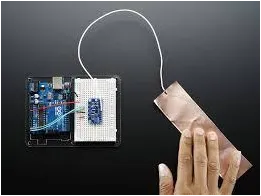
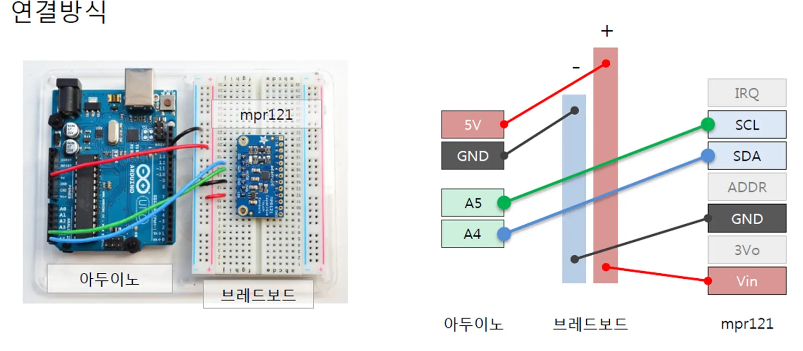
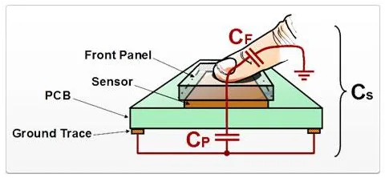

Capacitive sensor인 mpr121과, MIDI신호를 이용해서 터치 센서를 설계하려고 할때, 필요한 지식들을 몇 가지 정리해보았다.

## 아두이노

- 널리 쓰이고 있는 마이크로 컨트롤러의 일종이다.
- Digital Input, Analog Input이 내장되어 있어서 LED, 모터, 센서, 버튼 등 외부 부품과 연동하여 사용하기 쉽다.
- USB로 컴퓨터에 연결하여 C언어로 작성한 코드를 아두이노 보드에 업로드 할 수 있다.

## mpr121

- 아두이노에 연결해서 쓸 수 있는 Capacitive 터치 센서 모듈이다. (사진속의 부품은 adafruit 제품이지만 다른 회사 것들도 거의 같다.)
- 최대 12개의 터치 센서를 사용할 수 있다.

### 연결 방법

MPR121 Breakout → Arduino Uno 연결:

- 3.3V → 3.3V
- SCL → A5
- SDA → A4
- GND → GND
- IRQ → D2

## Capacitive Touch Sensor

- 터치센서의 한 방식으로, 터치하는 지점의 정전용량(Capacitance) 변화를 감지하는 방식.
- 정전식, 정전용량식 터치센서 등으로도 불린다.
- 터치 센서의 다른 종류는 Registive Touch Sensor(저항막 방식, 감압식)가 있다.
- "Sensor Pad"는 전도체로 된 판(구리테이프)
- "Ground Trace"는 그라운드와 연결된 판으로 정전용량 변화가 더 민감해지도록 한다.
- Ground Trace의 넓이는 넓을수록 좋으며, 높이는 Sensor Pad 보다 같거나 살짝 아래에 위치하면 좋다.

## MIDI

- MIDI는 본래 전자 악기들 간에 소리에 대한 정보를 주고받기 위해 만들어진 신호 체계이다.
- 터치센서의 입력 정보를 컴퓨터가 받도록 하는데에 이 신호를 사용할 것이다.

### 특징

- 시리얼 방식이다.
- note on/off의 경우 그림과 같이 3 byte로 구성된다.

### 참고: 2진법과 16진법 표기

- Byte단위의 신호를 2진법(Binary), 16진법(Hexadecimal)으로 표기하는 경우가 많다.
- 2진법은 1,0으로만 이루어지며 숫자끝에 **b**를 붙임. (ex. 1100111b, 10000000b)
- 16진법은 0~9, A, B, C, D, E, F로 이루어진다. 숫자 앞에 **0x**를 붙임. (ex. 0x90, 0xA2)
  (16진법의 숫자 하나는 2진법의 숫자 4개를 묶은것이다)

  

## 아두이노로 MIDI out 구성

이전에 쓴 글에 더 자세하게 나와있음.

원문: [https://randomflik.blogspot.com/2017/05/capactive-sensormpr121.html](https://randomflik.blogspot.com/2017/05/capactive-sensormpr121.html)
