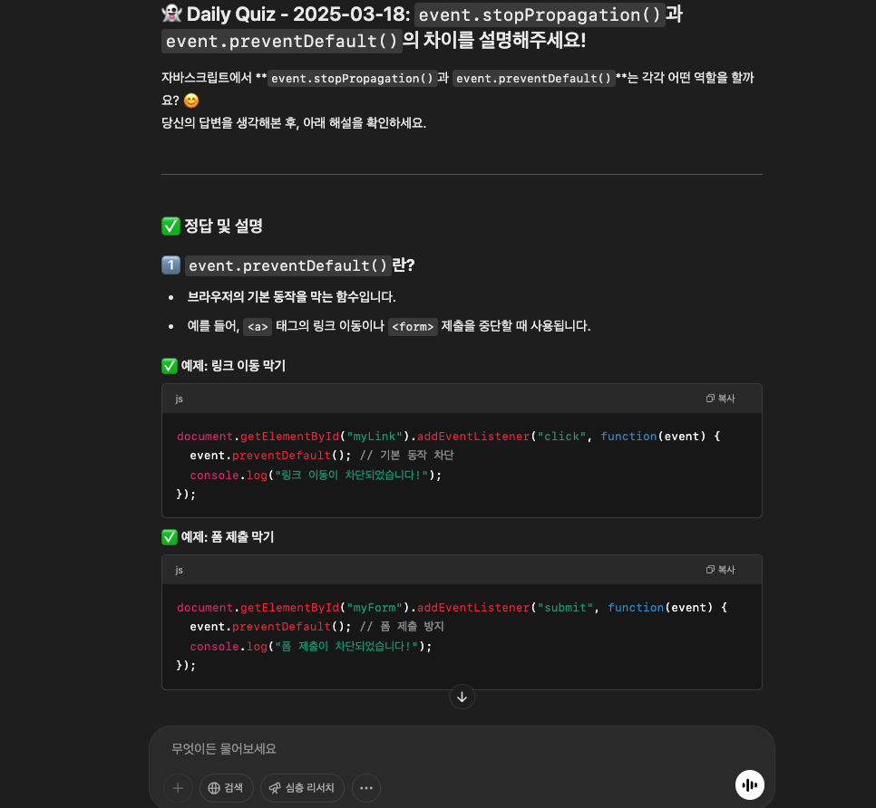

## AI의 시대에 취업 준비하기

AI를 활용하는 것이 요즘 당연한 시대가 되었다.

궁금한 내용을 AI에게 물어보고 복잡한 코딩을 대신 시키는 정도는 당연한 수준이지만, 그보다 좀더 잘 활용하기 위한 방법들은 아직 알려지지 않은 방법도 많은 것 같다.

그런 방법들을 찾기 위해 AI를 활용하는 아이디어가 날 때마다 테스트 해보는 편이다.

이런일도 시키면 어떨까? 하는 생각이 들때마다 한번 시켜보고 어 되네? 하면 발전시켜서 활용하는 식.

요즘은 취준 생활을 효과적으로 보내기 위해 AI를 다양하게 활용해보고 있는데, 그 중에서 효과적인 방법을 몇가지 소개해보려고 한다.

## 1. 가상 면접관

### 간단한 프롬프트로 시작하기

가짜 GPT를 만들어서 나에게 가상 면접을 제공하도록 한다.
가장 간단한 방법은 새 채팅을 만들고, 면접관이 되도록 요청하는 질문으로 시작하는 것이다.

아래처럼 시작해볼 수 있다.

```
당신은 프론트엔드(백엔드) 개발자 면접관입니다. 당신은 나의 기술적인 경험과, 기술적인 지식 수준을 검증하기 위한 질문을 해주세요. 나의 대답이 끝나면 각 질문에 대해 간단히 평가해주시고, 꼬리에 꼬리를 무는 질문으로 기술적인 깊이를 검증해주세요.
면접이 충분히 진행되었다면 전체적인 평가 및 피드백을 제공해주세요.
```

### 면접관의 성격 설정하기

여기서 어떻게 요청하느냐에 따라 면접관의 성격이나 질문 방식을 조절할 수 있다.

프론트엔드/백엔드 또는 특정 프레임워크를 사용하는 기업을 특정할 수도 있고 나의 기술적인 경험에 초점을 맞출수도 있다.

까다롭고 건방진 면접관을 설정해보았는데 반말을..


꼬리에 꼬리를 물고 질문해달라고 하는 프롬프트를 통해 실제 면접처럼 이야기를 흘러가게 만들기에 유용했다.


### 커스텀 면접관 (GPTS)

여러번 실험 해보면서 적당한 프롬프트를 조합하여 나만의 커스텀 GPTs 를 만들었다.


[개발자 면접관](https://chatgpt.com/g/g-QBfKPhEqi-gaebalja-myeonjeobgwan) <= 이 곳에서 링크를 클릭해서 직접 해볼수 있다.

### 💡TIP

이 방법은 음성 모드를 활용하면 더 효과적이다. GPT에게 직접 음성으로 대답해야 하기 때문에 질문에 대답하면서 실제로 말해보는게 큰 연습이 된다. 나는 주로 이동시간에 길거리나 지하철에서 많이 사용했다.

## 2. 나를 잘 알고 있는 봇

GPT에게 내 정보를 넘겨주고 나에 대한 맞춤형 대답을 해주는 커스텀 GPT를 만드는 방법이다. GPTs 기능을 사용했다.

두가지 버전이 있는데 첫번째는 채용담당자를 대상으로 나에 대한 궁금한 점을 대답해주는 봇(면접 대행봇이라고 하자) 그리고 두번째는 커리어 코칭 멘토이다.

### 개인정보 ISSUE!

사실 이력서와 자기소개서와 같이 개인정보라고 볼 수도 있는 데이터를 gpt에게 넘겨줘야 하기 때문에 개인정보를 넘겨주는 것이 민감한 사람이라면 이 방법을 활용하긴 어렵다.

나의 경우, 어차피 내 이력서는 웹에 업로드 되어있고 블로그도 공개적으로 다 올리는데 이걸 읽을 권한이 없는게 아니라서 AI의 활용을 더 적극적으로 하는게 이득이라고 생각해서 다 올렸다.

### 면접 대행봇

이력서 한장에 모든 내용을 담기 어렵기도 하고 어차피 읽고 싶은 내용 위주로 읽게 되는데 챗봇에게 궁금한거 위주로 물어보면 면접관도 편하지 않을까?

('아니' 라고 말하는 사람 있는거 알고 있음)

사실 면접관이 이걸 써볼 가능성은 작다고 생각하지만 재미있는 시도이기도 하고 미래의 이력서의 형태가 아닐까 상상해보면서 공유해본다.

이력서와 자기소개서, 내가 작성한 아티클 리스트, 이력서보다 더 많은 이야기들을 텍스트로 만들어서 제공했다.

단순히 yes/no로 대답하는게 아니라 입체적인 대답을 해준다.

부정적인 대답을 해야하는 순간에, 거짓말은 하지 않고 인정하면서도 최대한 긍적적인 부분을 어필 하도록 만들었다.

```
부정적인 답변이 필요할 경우, 사실을 전달하되 단점을 완화할 수 있는 긍정적인 면을 함께 어필해주세요.(지침의 일부 내용)
```


### 가상 커리어 멘토

두번째 GPT는 녀석과 나를 좀더 잘 알고, 어떻게 더 발전시킬지 조언을 해주는 멘토 역할이다.

이것은 공개되어 있지는 않지만 GPTs 기능으로 아래처럼 만들었다.


이렇게 이력서에 보강할만한 내용을 물었더니 잘 알려준다.


최근에 실제로 커리어 코칭을 받으면서 받은 피드백과 거의 유사했다.


## 3. 채용 기업 분석하기

### 지피지기면 백전백승

지피지기면 백전백승(나를 알고 적을 알면 백전 백승) 이라 했는데 나에 대해서 잘 알았으니 "적"에 해당하는 채용 기업에 대해 잘 알아야 하지 않을까?

회사의 채용공고를 비롯하여 최근 사업 분야에 대해서 조사하도록 한다.


### 나는 이 기업에 잘 어울리는 인재인가?

위에 언급한 GPTs를 모두 활용하는데, 특정 채용공고를 제공하고 내가 이 회사에 어울리는 인재인지, 혹은 해당 기업 지원을 위해 보완해야 할 점을 물어볼 수 있다.


대부분의 회사는 우대사항을 통해 뽑고싶은 사람에 대한 기술이나 성향에 대해 써놓는데 이 우대사항이 같은것 같으면서도 회사마다 차이가 있다.

이력서나 자기소개서에도 해당 기업에 의미있는 내용이 잘 돋보이도록 재배치해서 제출하게 되는데 이런 과정에서도 AI를 활용하는게 도움이 많이 되었다.


여러 채용공고를 매번 보다보면 새로운 채용공고를 봐도 그게 그거 처럼 느껴지지도 하는데 GPT에게 채용공고와 나를 대조해보도록 함으로써 내가 이 회사에 맞는 사람인지 체크하고 부족한 부분은 보완할 수 있다.

기업에 대한 키워드나 최근 소식같은것도 알기 좋다.


## 4. 스케줄링을 활용한 일일 공부법

GPTs에 스케줄링 기능이 언젠가부터 생겼는데, 나는 이 기능을 공부하는데에 주로 활용하고 있다.

GPT모델 중에서 스케줄링이 표시된 모델을 선택하고
"하루에 한번씩 ~해줘" 형식으로 질문하면, 실제로 하루에 한번씩 ChatGPT 앱에서 푸쉬 알림을 받을 수 있다.


사실 여러가지 언급했지만 스케줄링 기능이야말로 사람들이 가장 잘 모르지만 유용한 기능이다 같다.

이렇게 해놓으면 하루에 1번씩 GPT앱의 푸쉬 알림을 받을 수 있다.


하루에 한개씩 이렇게 질문해주고, 해설을 함께 받을 수가 있다!



사실은 내 답변을 듣고 해설을 해줘야 되는데 아직까지 이런 부분은 좀 변덕스럽다. 어떤날은 질문과 해설을 동시에 제공하기도 하고 어떤날은 질문만 제공하기도 한다.
그래도 주 목적은 데일리로 내가 생각해볼만한 질문을 던져주고, 해설을 통해 좀더 자세한 내용을 파악하는 것이라 그 목적으로 사용하는 데에는 지장이 없고 굉장히 유용하다.

나는 이 기능을 활용해서 3가지를 진행하고 있는데, 단골 기술면접 문제, AWS 자격증 예상문제, 코딩테스트 복습을 시간대별로 하루에 1-2개 씩 제공하도록 하고 있다.


## 마무리

'지피지기면 백전백승'이라는 말이 있지만, 그만큼 그만큼 나와 적을 잘 아는 것이 쉽지만은 않다는 말이다. 취업 준비는 나 자신과 지원하는 기업을 깊이 이해하는 과정이기도 하다.

이 글에서 소개한 네 가지 방법(가상 면접관, 맞춤형 AI 봇, 기업 분석, 스케줄링 기능)은 AI를 활용하여 이 과정을 더 효율적으로 만들어준다.

AI 활용법은 아직까지 정답이 없는 것 같고, 적극적으로 활용해보고 사례를 공유하는 것이 가치있다고 생각하여 이렇게 공유를 해보았다.
