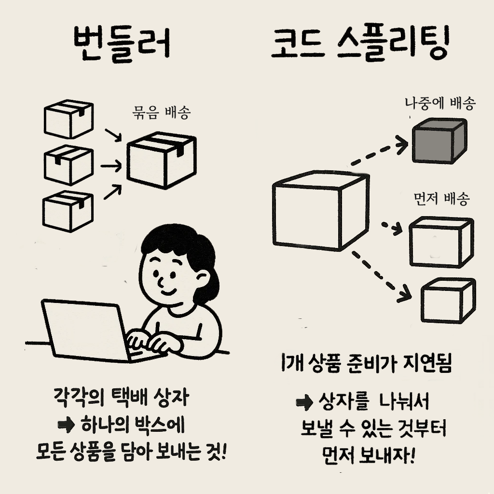

성능 최적화를 다루다보면 꼭 등장하는게 바로 코드스플리팅이다.
최근에 코드 스플리팅에 대한 질문을 받은 적이 있는데 제대로 답변하지 못하고 얼버무렸다.
그동안 알아보기를 미뤄왔던 내용들을 알아보면서 한번 다시 정리해본다.

---

## 코드 스플리팅이란?

**코드 스플리팅(Code Splitting)** 은 웹 애플리케이션의 초기 로딩 속도를 개선하기 위해 코드(특히 JS 파일)를 여러 개의 청크로 나누는 기법이다. 필요할 때만 해당 코드 청크를 불러오도록 하여 사용자 경험을 향상시킬 수 있다.

## 코드는 태초에 쪼개져(split) 있었다.

> 코드는 태초에 여러 파일로 구성되어 있었다.<br/>
> 그런데 **번들러**가 이들을 하나의 파일로 합쳤다.<br/>
> 그러다 파일이 너무 커지자, 이걸 다시 쪼개자고 한다.

코드스플리팅을 간단히 말하면, **코드를 분리한다**는 것인데 자바스크립트 코드가 원래부터 합쳐져 있었던 것은 아니다.

번들러가 하는 중요한 역할이 여러 자바스크립트 코드를 하나의 파일로 합치는 것이라면서...<br/>
이걸 다시 여러 파일로 쪼갠다니? 조금 이상하다고 생각 할 수 있다.

다음과 같이 택배애 대한 비유로 번들링과 코드스플리팅을 이해해볼 수 있다.



한 사이트에서 같은 판매자의 여러 상품을 주문할 때, 각각을 별도로 포장하는 것보다 하나의 박스에 모든 상품을 담아 보내는 것이 수신자에게도 편리하고 배송비도 절약된다. 이것이 바로 **번들러**의 역할이다.

이번엔 다시 예를 들어, 판매자 A의 상품 10개를 주문했다. 배송비 절감을 위해 당연히 묶음 배송을 선택하게 된다. 그런데 **10개 중 1개가 해외직구 상품이라 배송에 10일이 소요**된다고 한다. 나머지 9개 상품은 이미 준비되어 있지만, 한 번에 배송하기 위해 모든 배송이 지연된다. 결국 사용자는 **단 하나의 상품 때문에 모든 물건을 받는 데 오랜 시간을 기다려야 한다**.

이런 상황을 방지하기 위해 **먼저 보낼 수 있는 것은 먼저 보내는 방식**을 사용한다면 어떨까? 하나의 택배를 여러 개로 나누어 보내는 것이다. 이것이 바로 웹 개발에서 말하는 **코드 스플리팅**의 개념이다.

---

## 적용 방법

사용하는 기술 스택에 따라 적용 방식이 조금씩 다르지만, 일반적으로 많이 쓰는 React와 Webpack를 기준으로 한번 알아보자.

---

### React의 `React.lazy`

리액트에서는 기본적인 `React.lazy`를 사용하는것으로 코드 스플리팅이 된다. 이게 가능한 이유는 `import()` 를 통해 dynamic import를 하기 때문인데, 이것은 조금 아래에서 자세히 이야기한다.

아래 예시에서는 `React.lazy()`로 컴포넌트를 필요할 때 로딩하도록 하고, `Suspense`를 함께 사용하여 로딩 중일 때 보여줄 UI를 설정한다.

```jsx
import React, { Suspense } from "react";

const LazyComponent = React.lazy(() => import("./MyComponent"));

function App() {
  return (
    <div>
      <Suspense fallback={<div>로딩 중...</div>}>
        <LazyComponent />
      </Suspense>
    </div>
  );
}
```

---

#### React Router에서 코드 스플리팅 적용

React Router에서도 마찬가지로 아래 예시처럼 라우트 단위로 코드가 분리하면 페이지 별로 청크가 나누어져서, 초기 로딩 속도가 향상된다.

```jsx
import React, { Suspense, lazy } from "react";
import { BrowserRouter, Routes, Route } from "react-router-dom";

const Home = lazy(() => import("./pages/Home"));
const About = lazy(() => import("./pages/About"));

function App() {
  return (
    <BrowserRouter>
      <Suspense fallback={<div>로딩 중...</div>}>
        <Routes>
          <Route path="/" element={<Home />} />
          <Route path="/about" element={<About />} />
        </Routes>
      </Suspense>
    </BrowserRouter>
  );
}
```

---

### **Webpack의 Dynamic Import** 문법

Webpack은 `import()`를 만나면 자동으로 해당 모듈을 별도 청크로 분리해준다. 이것을 **dynamic import** 문법이라고 한다.

청크로 분리된 파일은 `xxx.chunk.js` 와 같은 파일 명으로 저장된다.

```js
// 이 코드만 있어도 Webpack이 알아서 분리함
const module = await import("./my-module.js");
```

아래 코드는 버튼을 눌렀을 때에만 heavy-module을 가져온다.

```js
button.addEventListener("click", async () => {
  const module = await import("./heavy-module");
  module.run();
});
```

### optimization.splitChunks

또한 Webpack 설정에서 `optimization.splitChunks`를 커스터마이징할 수도 있다.

| 옵션                     | 설명                                                                                                                                 |
| ------------------------ | ------------------------------------------------------------------------------------------------------------------------------------ |
| `chunks`                 | `'async'`, `'initial'`, `'all'` 중 선택. <br>**all**이면 동적 로딩 + 초기 로딩 모두 분리 대상                                        |
| `minSize`                | 청크가 이 크기 이상일 때 분리함 (기본: 20KB)                                                                                         |
| `minChunks`              | 몇 개 모듈 이상에서 사용되면 분리 대상이 되는지                                                                                      |
| `cacheGroups`            | 어떤 모듈을 어떤 기준으로 묶을지 결정하는 핵심 설정<br>- `vendors`: `node_modules` 기준<br>- `default`: 프로젝트 내부 공통 코드 기준 |
| `automaticNameDelimiter` | 청크 이름 구분자(기본값은 `~` 이며 `_`, `-` 등 설정 가능)                                                                            |

`chunks: 'all'`만 해도 많은 최적화가 자동으로 적용된다.

```js
// webpack.config.js
module.exports = {
  optimization: {
    splitChunks: {
      chunks: 'all', // 기본 설정: async, initial, all 중 선택
      minSize: 20000, // 청크 최소 크기 (20KB 이상일 때 분리됨)
      maxSize: 0,     // 0이면 무제한 (나누지 않음)
      minChunks: 1,   // 모듈이 최소 몇 번 이상 쓰일 때만 분리할지
      automaticNameDelimiter: '~', // 청크 이름 구분자 (기본 ~)
      ...
    },
  },
};
```

좀더 자세한 설정은 아래처럼 할 수 있다.

```js
// webpack.config.js
module.exports = {
  optimization: {
    splitChunks: {
      chunks: "all", // 기본 설정: async, initial, all 중 선택
      minSize: 20000, // 청크 최소 크기 (20KB 이상일 때 분리됨)
      maxSize: 0, // 0이면 무제한 (나누지 않음)
      minChunks: 1, // 모듈이 최소 몇 번 이상 쓰일 때만 분리할지
      maxAsyncRequests: 30, // async 로딩 시 동시에 요청 가능한 최대 청크 수
      maxInitialRequests: 30, // initial 로딩 시 동시에 요청 가능한 최대 청크 수
      automaticNameDelimiter: "~", // 청크 이름 구분자 (기본 ~)
      enforceSizeThreshold: 50000, // 강제로 청크를 분할할 기준 크기
      cacheGroups: {
        vendors: {
          test: /[\\/]node_modules[\\/]/,
          name: "vendors",
          chunks: "all",
          priority: -10,
        },
        default: {
          minChunks: 2,
          priority: -20,
          reuseExistingChunk: true,
        },
      },
    },
  },
};
```

### 🔍 cacheGroups

cacheGroup은 특정 모듈들을 그룹화하여 별도의 청크(chunk)로 분리하는 옵션이다. 같은 cacheGroup에 속한 모듈들은 함께 번들링된다.

아래는 cacheGroups의 좀 더 자세한 예시이다.

```js
cacheGroups: {
  reactVendor: {
    test: /[\\/]node_modules[\\/](react|react-dom)[\\/]/,
    name: 'react-vendor',
    chunks: 'all',
    priority: 10,
  },
  commons: {
    test: /[\\/]src[\\/]components[\\/]/,
    name: 'common-components',
    chunks: 'all',
    minChunks: 2,
  }
}

```

이 설정에서 `react`와 `react-dom`은 `react-vendor.js` 또는 `react-vendor~1.js`, `react-vendor~2.js` 같은 형태로 저장될 것이다.(주로 maxSize를 지정했을 때 청크가 이렇게 여러개로 분리된다.)

마찬가지로 여러 곳에서 쓰이는 공통 컴포넌트는 `common-components.js` 또는 `common-components~1.js`, `common-components~2.js`처럼 취급된다.

---

### **Next.js에서의 코드 스플리팅**

Next.js는 페이지 기반 코드 스플리팅을 기본으로 지원한다. 하지만 `dynamic import()`를 사용해 더 정밀하게 분리할 수 있다.

```js
import dynamic from "next/dynamic";

const DynamicComponent = dynamic(() => import("../components/HeavyComponent"), {
  loading: () => <p>로딩 중...</p>,
});
```

---

## 실제로 청크가 나누어졌는지 확인하기

### Bundle Analyzer

사용하는 번들러에 따라, Bundle Analyzer를 활용해서 청크가 나누어진 구조를 확인할 수 있다. 이 데이터를 시각화 툴을 활용해서 보면 좀 더 직관적으로 확인할 수 있다.

Webpack에서는 [**Webpack Bundle Analyzer**](https://www.npmjs.com/package/webpack-bundle-analyzer)를 활용해서 확인할 수 있다.

Next.js를 사용한다면 [**@next/bundle-analyzer**](https://www.npmjs.com/package/@next/bundle-analyzer)를 사용한다. 내부적으로는 webpack으로 되어있기 때문에 Webpack Bundle Analyzer를 warpping한 것이지만, Next.js의 빌드 파이프라인에 맞게 적용되어있어서 설정이 좀더 간단하다.

Vite에서는 **rollup-plugin-visualizer**를 사용한다.

### 사용 방법

사용방법은 웹팩을 기준으로만 설명하겠다.
설치 후에 플러그인 추가하고, 실행해보면 된다.

1. 설치

```bash
npm install --save-dev webpack-bundle-analyzer
```

2. Webpack 설정에 플러그인 추가

```js
// webpack.config.js
const { BundleAnalyzerPlugin } = require("webpack-bundle-analyzer");

module.exports = {
  // ... 기존 설정들
  plugins: [new BundleAnalyzerPlugin()],
};
```

3. 실행

```bash
npx webpack --mode=production
```

4. Webpack stats 파일 생성 + 분석

다음과 같이 `stats.json`을 생성한다.

```bash
npx webpack --mode=production --json > stats.json
```

이렇게 해서 생성된 `stats.json`를 통해 청크 구조를 확인할 수 있는데, 이 파일을 시각화 해주는 사이트에 업로드하면 좀더 직관적으로 볼 수 있어 유용하다.

시각화 사이트 목록

- https://webpack.github.io/analyse/
- [https://www.bundle-buddy.com/](https://www.bundle-buddy.com/)
- https://alexkuz.github.io/webpack-chart/

### @next/bundle-analyzer

Next.js 에서는 @next/bundle-analyzer를 사용하면 `.next/analyze/client.html`, `server.html` 같은 리포트 파일을 자동으로 생성해주기 때문에 좀 더 간편하게 사용할 수 있다.

아래와 같이 설치한 다음

```bash
npm install @next/bundle-analyzer
```

`webpack.config.js`를 설정하면 된다.

```js
const withBundleAnalyzer = require("@next/bundle-analyzer")({
  enabled: process.env.ANALYZE === "true",
});
module.exports = withBundleAnalyzer({});
```

여기서 `enabled: process.env.ANALYZE === 'true'`는 설정 파일에서 환경 변수 `ANALYZE`의 값이 'true'일 때만 번들 분석기를 활성화하겠다는 조건이다.

아래와 같이 빌드를 실행하면, 빌드가 끝난 뒤 브라우저가 자동으로 열리면서 분석 결과를 띄워준다.

```bash
ANALYZE=true npm run build
```

## 마무리

요즘 자바스크립트를 기반으로 한 웹 어플리케이션은 점점 복잡해지고 있기 때문에 코드스플리팅을 비롯한 성능 최적화가 굉장히 중요하다. 코드 스플리팅이 적절하게 되지 않는다면, 거북이처럼 느린 웹사이트를 사용자에게 전달하게 될 것이다.  
이 글에서는 코드 스플리팅이 언제 어떻게 일어나는지 정확히 파악하고, 번들 분석 도구를 통해 나눠진 청크를 눈으로 직접 확인하여 검증하는 방법을 수록하였는데, 더 나아가 실제로 코드스플리팅이 필요한 순간을 파악하고 적절하게 활용하는 능력은 프론트엔드 엔지니어의 구현 능력에 있어서 한 끝 차이의 디테일이 될 것 같다.
