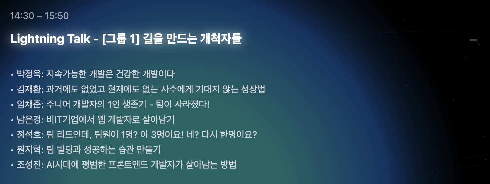
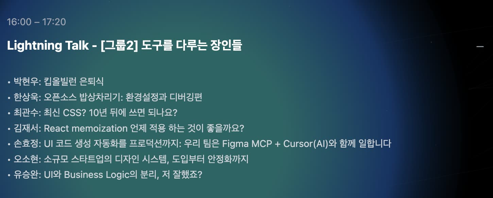

## FEConf 2025 에 다녀왔다

이전에도 개발자 컨퍼런스를 몇 번 다녀왔지만 이번 FEConf 2025 에서는 감회가 새로웠다. 
과거엔 초심자 혹은 주니어의 입장에서 마주치는 모든게 새로웠다면 이번엔 익숙함 속에서 새로움을 찾기 위한 노력을 필요로 했다.
그 노력이 충분했나? 에 대해서는 아쉬운 점이 있지만 그래도 다녀온 후기를 기록할겸 글을 작성해본다.

이전까지는 주로 혼자서 컨퍼런스를 다녀왔던 기억이 많은데 이번에는 인사를 나눌 사람들이 많이 있었던 게 좋았다. 
항해 플러스를 통해 만난 개발자분들, 최근 기술 블로그 글쓰기 모임에서 인연을 맺은 분들과 인사를 나눌 수 있어서 반가웠다. 
누가 컨퍼런스에 왔는지 잘 모르다 보니 인사 자체를 나누지도 못한 분들이 많았는데 아쉬웠다. 

## 메인 발표 대신 얻은 것

이번에는 일부러 메인 발표를 듣지 않았다. 발표 주제에 관심이 안 갔던 것은 아니지만 어느정도 발표 주제에 대해서 유추할 수 있는 내용도 있고, 발표자의 블로그나 FEConf 유튜브 채널을 통해 다시 확인할 수 있기 때문이다. 

그보다는 다른 네트워킹 존에서 다른 개발자들과 직접 대화할 수 있는 활동에 참여하고, 유튜브를 통해 다시 볼 수 없는 라이트닝 토크 관람에 집중했다. 결과적으로는 메인 발표 관람을 통해 얻는 것 만큼이나 좋은 인사이트를 많이 받은 것 같다.

### 네트워킹 존

메인 발표 외에 네트워킹 존에서 각 주제별로 모여서 대화를 나눌 수 있는 공간이 있었다. 나는 취업/이직에 대한 네트워킹에 참여했다. 최근까지 가장 직접적으로 관심있는 주제이고 다른 분들은 어떻게 하고 있는지 궁금했었다.  다른 분들의 이야기를 들으면서, 나도 최근까지 면접을 경험하면서 느꼈던 생각들을 나누었다. 요즘 개발자 취업의 어려움에 대해서 공감을 나눌 수 있었다. 이외에도 흥미로운 주제의 이야기가 많았는데, 이후에는 라이트닝 토크 관람을 위해 네트워킹 존에 더 참여하지는 못했다. 다음번에 기회가 온다면 더 많은 분들과 다양한 주제로 이야기에 참여해보고 싶다.

### 라이트닝 토크

라이트닝 토크는 10분이라는 짧은 시간에 발표하는 방식이다. 짧은 시간에 주제를 전달하기 위해 압축적으로 준비해준 발표라 그런지 오히려 30분짜리 메인 발표보다 집중도가 높았던 것 같다. 개발 외적인 주제도 신선했다.
예전 파이콘에서 경험한 라이트닝 토크는 현장에서 발표자를 모집해서 즉흥적인 재미가 있었던 기억이 났다. 이번엔 그런 즉흥적인 재미는 없었지만, 완성도 있게 준비된 발표의 장점이 크게 다가와서 오히려 좋았던 것 같다.

### 오늘의집 네트워킹 파티

오늘의집 네트워킹 파티 이벤트에 운이 좋게도 선정되어서 참여했다. 오늘의 집 채용 담당자와 오늘의 집 FE 개발자, 그리고 나처럼 초대된 신입 개발자와 함께 저녁을 나누며 이야기를 나눌 수 있었다. 

채용 담당자는 최근 개발자를 뽑는 TO 자체가 적어 신중하게 뽑을 수밖에 없다는 현실적인 이야기를 해주었고, 과거 내 지원 경험에 대한 피드백도 들을 수 있었다. 신입 개발자는 취업에 대한 고민이 많았고, 공감이 되었다. 오늘의 집 FE 개발자분은 본인의 경험을 많이 소개 해주셨다. 모르는 문제라도 적극적으로 해결하려는 태도, 스스로 잘하는게 뭔지 파악하려는 노력 등에 대해서 이야기 해주셨는데 나 또한 스스로에 대해서 다시 생각해보는 시간이었다. 

기업에서 이렇게 예비 지원자들을 식사 자리에 초대하는 것은 처음이라 새롭게 느껴졌고 오늘의 집에 대해서 긍정적으로 생각하게 되는 경험이었다.

## 기억에 남는 발표들

### 리더쉽과 팀 빌딩

먼저 팀 리더십과 관련된 발표가 인상 깊었다. 최근에 채용 지원을 하면서 스스로에게 아쉬웠던 게 팀을 리드한 경험이 없다보니 실제로 겪을 법한 간접 경험들을 끌어내려고 고민했던 차라, 실제 개발팀을 리드하면서 겪는 문제들을 이야기하는 발표에 관심이 많이 갔다.

- **정석호님**의 발표 **'팀 리드인데, 팀원이 1명? 아 3명이요! 네? 다시 한명이요?'**에서는 소규모 팀 리드의 현실적인 고민을 엿볼 수 있었다. 처음 리더가 되었을 때 맞이하는 고민들을 간접적으로 경험할 수 있어서 좋았다.
    
- **원지혁님**은 **당근**에서 경험한 개발자에서 매니저까지 역할의 변천사를 들려주셨는데, "사람은 습관에 의해 변하기 때문에 팀의 습관이 무엇인지 고민하고 설계한다"는 말이 크게 다가왔다. 이 내용은 팀 빌딩 뿐 아니라 개인 차원에서도 적용할 수 있는 이야기여서 스스로의 습관에 대해 되돌아보는 계기가 되기도 했다. 이외에도 내가 가장 잘하는 것을 팀원에게 맡겨보면서 신뢰를 쌓을 수 있다는 이야기도 기억에 남는다. 

두 분의 발표를 들으면서 내가 경험한 팀 리더가 떠올랐다. 당시에는 팀원의 역할에만 충실했던 것 같은데 발표를 들으면서 당시의 기억을 되돌아보니 팀의 습관과 환경을 위해 고민과 노력을 많이 했겠다는 생각이 들었다.

### 디자인 시스템

그리고 디자인 시스템과 관련된 발표도 도움이 되었다. 
**오소현**님의 **'소규모 스타트업의 디자인 시스템, 도입부터 안정화까지'** 를 들으면서 최근 면접 경험이 오버랩되었다. 소규모 팀에서 디자인 시스템을 도입하는 것이 리소스가 크게 드는데 어떻게 했는지에 대한 질문을 실제로 받았지만 내 대답이 아쉬웠던 기억이 난다. 이번 발표처럼 이야기했던 더 좋았겠다는 생각이 들어서 참고가 많이 되었다.

**손효정**님은 발표를 통해서 **오늘의집**에서 Figma MCP와 Cursor를 통해 UI 생성을 성공적으로 자동화한 사례를 소개해주셨는데, 디자인과 개발 사이의 생산성을 향상이라는 측면에서 디자인 시스템과 연관지어 생각했다.
AI를 통한 생산성 향상에도 관심을 많이 가져왔지만 피그마와의 연동은 잘 하지 못하고 있었는데, 성공적으로 연동하는 과정을 들을 수 있어서 유익했다.

### 오픈소스 기여

**한상욱**님의 **'오픈소스 기여 경험과, 입문자를 위한 가이드'** 발표는 실제 기여 경험과, 기여하면 좋은점, 입문자를 위한 가이드가 와닿았다. 발표를 듣고 나서 발표 내용을 따라서 오픈소스를 기여를 해보려고 했는데 아직 성공하지는 못했다. 
그런데 실제로 해보니 어떤 레포에 기여할지 고르는 과정부터 쉽지는 않았다. 시행착오를 겪고 있지만 언젠가 꼭 성공하고 싶다.

### 킵올빌런 은퇴식

마지막으로 css의 "keep-all" 속성을 주제로 한 **박현우** 님의 **'킵올빌런 은퇴식'** 은 처음부터 끝까지 깊은 공감과 재미를 준 발표였다. 마지막에 계정을 삭제하는 퍼포먼스까지 완벽했다. 또한 keep-all 속성에 대한 깊은 각인을 주어서 정보 측면에서도 유익했다.

## 앞으로의 고민

결국 가장 깊게 남은 키워드는 “습관”이었다. 

발표 내용은 팀의 습관에 대한 이야기였지만, "나는 어떤 습관을 통해 어떤 사람이 되어가는가?" 를 질문해보았다. 퇴사 이후 루틴을 만들고 지켜오면서 성취도 있었지만, 작은 변화에도 쉽게 깨진 경험을 반복해왔다. 강제성이 사라지면 무너지고, 환경이 바뀌면 흔들렸다.

앞으로는 습관이 깨지는 순간을 더 민감하게 감지해야겠다는 생각이 들었고. 더 나아가 깨지지 않는 견고한 루틴을 만드는 방법도 고민하게 된다. 사람의 의지력은 쉽게 변하지만 공간, 관계, 약속 등 .. 변하지 않는 것들을 환경으로 더 배치하고 이를 통해 나의 습관을 보강하는 것을 생각중이다.

## 마무리

이번 컨퍼런스는 기술적 인사이트보다 삶의 태도와 습관에 대해 더 많은 생각을 하게 했다. 
개발자 컨퍼런스가 결국 기술만 논하는 자리가 아니라, 개발자라는 삶 자체를 돌아볼 수 있는 장이라는 것을 새삼 느꼈다.