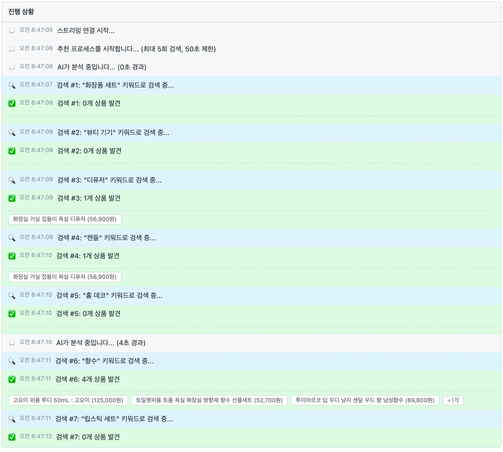
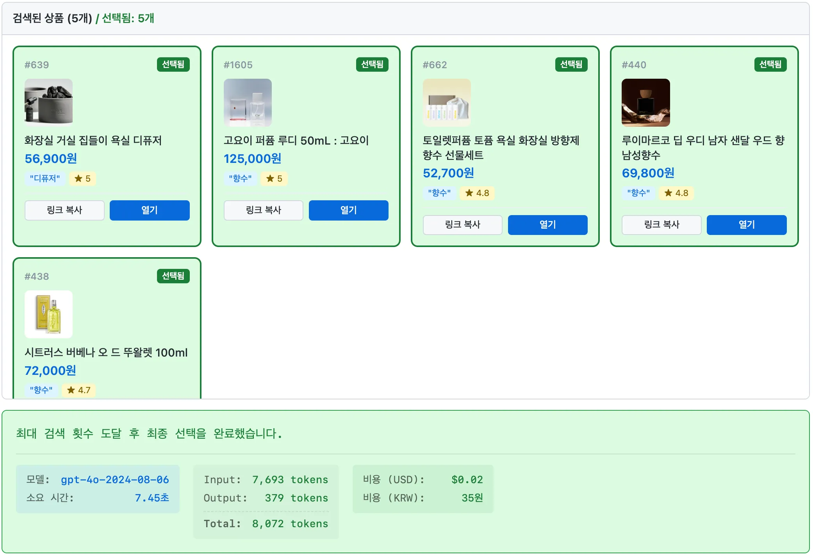

## 들어가며

사이드 프로젝트로 상품 추천 서비스를 개발하고 있다. 사용자가 입력한 상황을 바탕으로 LLM의 도움을 받아 딱 맞는 상품을 추천하는 것이 핵심 가치이다. 초기에는 꽤 높은 기대를 갖고 시작했으나, 실제 구현을 거치며 기대와는 다르게 추천 품질이 안정적이지 않다는 문제를 마주했다.

더 이상 이 프로젝트에 가망이 없다고 생각하던 차에 **Function Calling**을 활용해 추천 품질을 개선할 수 있었는데, 이 방법을 소개해보려고 한다.

---

## 기존 작동 방식

초기 버전의 추천 시스템은 다음과 같이 작동했다.

1. **사용자가 상황을 제공한다**
   예: “20대 여성에게 운동 관련 선물을 주고 싶음”
2. **LLM이 추천에 필요한 ‘키워드’를 생성한다**  
   예: 운동화, 요가매트, 런닝웨어 등
3. **해당 키워드로 DB 검색을 수행한다**
   - BFF가 서버에 키워드를 요청한다.(LLM이 하는 것이 아님)
   - 검색은 단순 문자열 포함/일치 기반이다.
4. **검색 결과에서 상위에 있는 상품을 선정하여 추천**

처음에는 이렇게 키워드를 추출하는 방식만으로도 충분히 괜찮은 추천이 될 것이라고 기대했다. 하지만 실제로는 전혀 그렇지 않았다.

## 기존 방식이 가진 문제

기존 방식에 문제가 있는 가장 큰 이유는 키워드만 추천하는 것으로는 실제 추천되는 상품의 추천 품질을 보장하지 못한다는 것이다.

다르게 말하면 LLM은 키워드만 생성할 뿐, **실제로 어떤 상품이 추천되는지는 알지 못한다.**

따라서 다음과 같은 문제가 종종 발생했다.

#### 상황에 맞지 않는 상품 추턴

- 20대 여성에게 ‘남성용 운동화’가 추천됨

#### 검색 결과가 없는 키워드

"화장품"으로 검색하면 검색 결과가 있지만 “고급 화장품 세트”로는 검색 결과가 없다.
그렇지만 LLM은 이 차이를 알지 못하기 때문에 "고급 화장품 세트" 같은 검색어를 계속 사용한다.

### 프롬프트만 수정해서는 해결되지 않는다

이런 문제를 해결하기 위해서 처음에는 프롬프트 수정을 시도해왔지만 키워드 생성 프롬프트를 아무리 다듬어도 상품 DB 구조를 LLM이 정확히 알 수 없기 때문에
결국 프롬프트를 더 잘 쓰는 것으로는 해결할 수 있는 영역이 아니라고 판단했다.

따라서 근본적으로 **LLM이 실제 상품 결과를 직접 보며 판단하게 하는 방식**으로 Function Calling을 활용하게 된다.

---

## 새로운 작동 방식

### LLM이 직접 상품을 고르게 하기

이 방식의 핵심 아이디어는 **LLM이 직접 검색 결과를 검토하게 만든다**는 것이다.

Function Calling을 통해 LLM에서 `searchProducts(keyword: string)`라는 도구를 쥐어준다.
그러면 LLM이 직접 검색을 요청하고, 검색 결과를 받아서 그 중에서 적절한 상품을 골라준다.

기존처럼 키워드 생성 → 서버 검색 → 결과 전달 구조가 아니라 LLM이 `searchProducts` 함수를 직접 호출해 상품 리스트를 받는 것이다.

키워드를 최대 N개까지 스스로 검색하면서 그 중에서 적절한 상품을 골라준다.

최종적으로 이제 LLM은 **실제로 DB에 존재하는 상품들 중에서** 컨텍스트를 기반으로 가장 적절한 상품을 논리적으로 골라줄 수 있다.





### LLM에게 제공하는 함수 스키마

Function Calling을 활용할 때, 아래와 같은 스키마를 API요청과 함께 제공해야 한다.

```json
{
  "name": "searchProducts",
  "description": "키워드로 상품 목록을 검색합니다.",
  "parameters": {
    "type": "object",
    "properties": {
      "keyword": { "type": "string" }
    },
    "required": ["keyword"]
  }
}
```

### 개선 효과

이렇게 검색 결과를 직접 검토할 수 있게만 해도 놀라운 개선이 있었다.

- 성별·카테고리 mismatch가 크게 줄어듦
- 검색 실패 시 스스로 새로운 키워드를 탐색
- 검색 결과 내에 중복 상품이 있더라도, 다양한 상품을 골라줌.

### 여전한 문제


이렇게 나아지긴 했지만 실제 추천 품질이 나아지지는 못했는데 문제가 좀 더 있었다.

- 검색 결과가 나오지 않는 키워드를 계속 반복 시도.
- 이전 검색 시도 내용이 다음 전략에 반영되지 않음.

이런 현상이 발생하는 이유는 LLM이 현재 상황에 대한 정보를 모르기 때문이다.

## 앞으로의 개선 방향

우선 “지금까지 어떤 검색을 했고 어떤 결과였는지”를 추가로 전달해주고 검색에 대한 전략도 추가로 제공한다.

또 저빈도 키워드와 고빈도 키워드를 미리 파악하여 LLM에게 전달하는 것도 고려하고 있다.

이 문제를 해결하는 방향은 사실 더 많은 방법이 있을 것이다. 특히 키워드 검색 엔진을 고도화하는 방법에도 관심이 있지만, 현재 단계에서 새로 구축하는데에는 훨씬 더 많은 시간이 들 것으로 판단했다.

그래서 현재 진행중인 방향으로 좀 더 시도를 하게 될 것 같다.

## 마무리

LLM을 프로덕트에 어떻게 반영할지에 대한 여러 시도가 있겠지만 각자가 방법을 숨기고 있기에 널리 알려지는 것 같지는 않다. Function Calling이 나온 것은 꽤 오래 전이지만 생각보다 잘 되어서 놀라왔다.
Function Calling을 통해 LLM이 실제 상품을 검토하며 판단하는 구조를 만들 수 있다는 것은 해보지 않으면 몰랐을 것인데, 좀더 발전시켜 보면서 좀 더 나은 추천품질을 제공할 수 있을 것으로 기대된다.
이 프로젝트를 좀 더 진행 해보면서 더 자세한 내용을 써보려고 한다.
