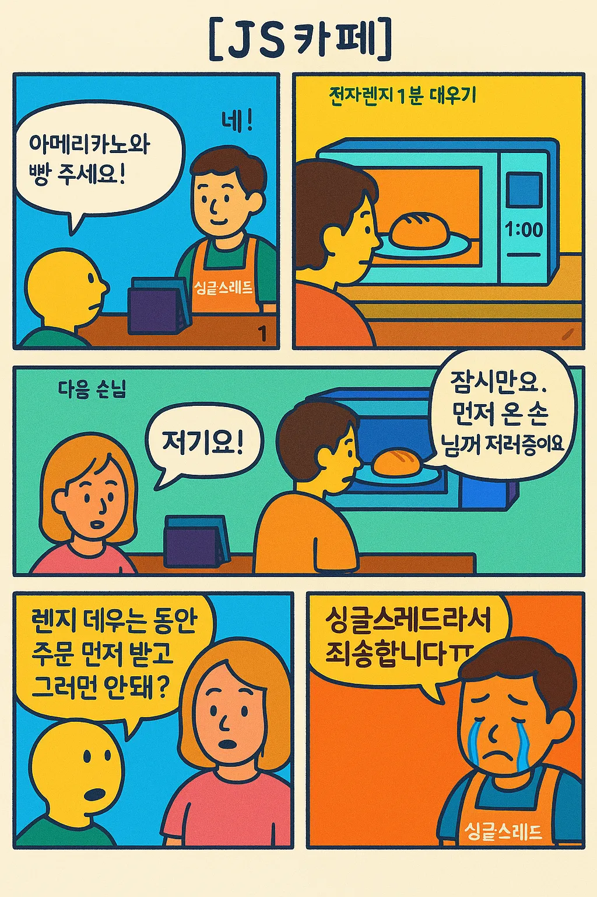
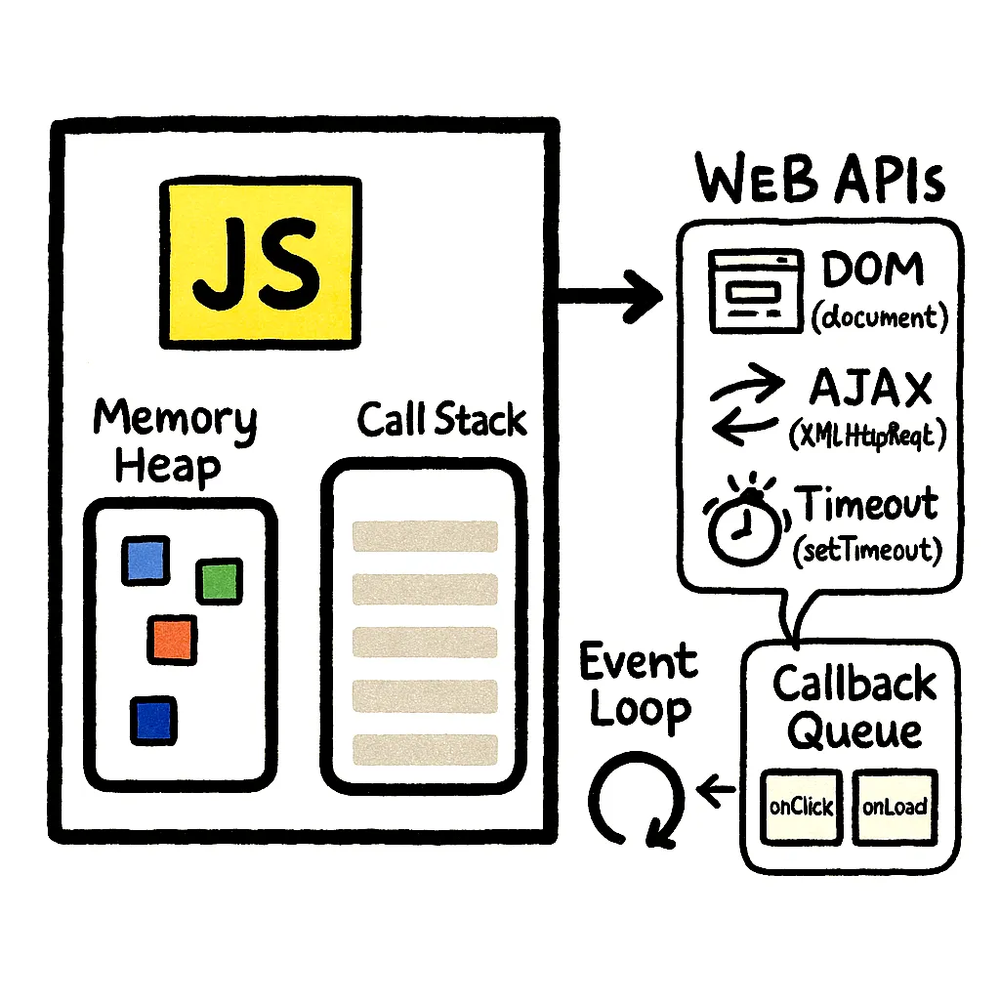

## 이벤트 루프가 왜 필요할까?

자바스크립트를 깊이 있게 사용하려면 반드시 접하게 되는 개념이 바로 **이벤트 루프**이다.

기술면접 단골 질문이고, 타 블로그에서도 이미 많이 다루어진 주제이다.

**이벤트 루프**는 자바스크립트가 브라우저에서 동작하는 핵심 원리로, 이벤트 루프는 콜 스택과 태스크 큐(콜백 큐)를 기반으로 태스크가 실행되는 순서를 효율적으로 관리하는 방법이다.

자바스크립트는 기본적으로 싱글 스레드 기반의 언어이다. 싱글스레드는 하나의 작업만 동시에 실행할 수 있다. 시간이 많다면 모든 작업을 순차적으로 기다려가면서 실행해도 문제가 없겠지만 실제로 유저들은 아주 성격이 급하고, 또 어떤 이벤트는 빨리빨리 처리해줘야 하기 때문에 이런 일들을 효과적으로 처리할 방법이 필요한 것이다.



위의 만화는 비유적인 예시이긴 하지만 실제로 JavaScript가 동작할 때에도 오래걸리는 태스크 때문에 다른 작업이 실행되지 못하고 블락되는 상태가 발생한다.

이번 글을 통해 자바스크립트가 어떻게 동작하는지 좀더 자세히 이해해보자.

---

## 1. 자바스크립트 실행 환경 구조

### ✅ 자바스크립트 엔진(V8)

자바스크립트는 **브라우저나 Node.js**에서 동작한다.  
이 중에서 **실제로 자바스크립트 코드를 실행하는 역할**은 **자바스크립트 엔진**이 담당한다.  
**V8**은 구글이 개발한 대표적인 자바스크립트 엔진으로, Chrome과 Node.js에서 사용되고 있다.

V8이 하는 일은 다음과 같다:

- 자바스크립트 코드를 파싱하고 실행한다
- 변수, 함수 호출, 연산 등 로직을 수행한다
- 콜 스택을 관리한다

그런데 여기서 주의할 점은, **V8은 비동기 함수나 타이머 같은 기능은 직접 제공하지 않는다는 점**이다.
이런 기능은 브라우저의 Web API나 Node.js의 호스트 환경(Host Environment)이 담당한다.

---

### ✅ Web API

`setTimeout`, `fetch`, `addEventListener`, `requestAnimationFrame` 같은 함수들은 사실 자바스크립트 자체가 아니라, **브라우저가 제공하는 Web API**이다.

setTimeout을 예시로 Web API의 동작 순서를 알아보자!

1. 자바스크립트 코드에서 `setTimeout()` 호출
2. 브라우저의 타이머 시스템이 지정된 시간 동안 대기한 후, 콜백 함수를 실행할 준비를 함.
3. 시간이 지나면 콜백을 **태스크 큐(task queue)**에 넣음
4. 이벤트 루프가 콜 스택이 비었을 때 이를 실행함

이렇게 함수의 실행순서를 조율하는 것이 바로 **이벤트 루프(Event Loop)**이다.

---

## 2. 이벤트 루프의 동작 순서



자바스크립트의 이벤트 루프의 작동을 간단히 나타내면 이렇다.

1. 콜 스택 실행
2. 마이크로태스크 큐 실행
3. `requestAnimationFrame` 콜백 실행
4. 브라우저 렌더링
5. 매크로태스크 큐 실행

---

## 3. 콜 스택과 태스크 큐

### 콜 스택

콜 스택은 자바스크립트 코드가 실행되는 메인 스레드의 실행 컨텍스트를 관리하는 자료구조이다.
함수가 호출되면 콜 스택에 쌓이고, 함수가 종료되면 스택에서 제거된다.

스택 구조인 이유는 함수를 실행하는 과정을 보면 알 수 있다.

예를 들어, 다음과 같은 코드가 있다고 가정해보자.

```javascript
function first() {
  console.log("first");
  second();
}

function second() {
  console.log("second");
  third();
}

function third() {
  console.log("third");
}

first();
```

이 코드의 실행 결과는 다음과 같다.

```
console.log('third');
console.log('second');
console.log('first');
```

`first` 함수가 호출되면 콜 스택에 쌓이고, 그 안에서 `second` 함수를 호출하여 `second`가 쌓이고, 마지막으로 `third` 함수가 쌓인다.
마지막으로 쌓인 `third` 함수가 가장 먼저 실행을 마치면서 스택에서 제거되고, second, first 순서로 제거되면서 'third', 'second', 'first' 순서로 로그가 출력된다.
이처럼 함수의 실행 순서가 스택의 LIFO(Last In First Out) 특성과 일치하는 것을 볼 수 있다.

### 태스크 큐

태스크 큐는 비동기 작업의 콜백 함수들이 대기하는 곳이다.
Web API에서 처리된 작업이 완료되면 해당 콜백이 태스크 큐에 추가되고,
이벤트 루프는 콜 스택이 비어있을 때 태스크 큐에서 콜백을 꺼내 실행한다.

태스크 큐가 실행되는 순서는 기본적으로 먼저 등록된 것이 먼저 실행되지만,
큐에서 처리해야 하는 작업에는 우선순위가 존재하므로 우선순위에 따라 몇개의 마이크로태스크 큐와 매크로태스크 큐로 나눠서 관리된다.

마이크로태스크큐가 먼저 실행된다.

### 이벤트 루프의 작동 순서

이벤트 루프는 다음과 같은 순서로 동작한다.

1. 콜 스택이 비어있는지 확인
2. 비어있다면 태스크 큐에서 대기 중인 콜백을 꺼내서 콜 스택에 추가
3. 콜백이 실행되면 다시 1번으로 돌아감

이러한 구조 때문에 자바스크립트는 비동기 작업을 처리할 수 있으면서도
싱글 스레드의 특성을 유지할 수 있다.

## 4. 마이크로태스크와 매크로태스크, 그리고 requestAnimationFrame

| 종류                  | 예시                                 | 우선순위  | 설명                        |
| --------------------- | ------------------------------------ | --------- | --------------------------- |
| 마이크로태스크        | `Promise.then`, `queueMicrotask`     | 매우 높음 | 콜 스택이 비면 즉시 실행됨  |
| requestAnimationFrame | `requestAnimationFrame`              | 중간      | 렌더링 직전에 실행됨        |
| 매크로태스크          | `setTimeout`, `setInterval`, `fetch` | 낮음      | 다음 루프 사이클에서 실행됨 |

이벤트 루프는 매 루프 사이클마다 **마이크로태스크 큐를 우선적으로 모두 실행**한 후에야  
다음 단계인 `requestAnimationFrame`, 렌더링, 매크로태스크 실행으로 넘어간다.

마이크로태스크 큐는 모든 작업이 비워질 때까지 실행하지만, 매크로태스크는 한 사이클에 한개의 태스크만 처리하고 나머지는 다음 사이클에 다시 또 실행한다는 차이가 있다.

**requestAnimationFrame(rAF)**은 브라우저의 렌더링 타이밍과 동기화되어 실행되는 특수한 API로 일종의 큐로 관리됩니다. rAF는 브라우저가 새로운 프레임을 렌더링 하기 직전에 실행됩니다.

종합하면, 이벤트 루프는 다음과 같은 순서로 동작합니다

1. 콜 스택이 비어있는지 확인합니다
2. 마이크로태스크 큐에 있는 모든 태스크를 먼저 실행합니다 (Promise.then, queueMicrotask 등)
   - 마이크로태스크 큐의 모든 작업이 비워질 때까지 실행합니다
3. 마이크로태스크 실행 중 새로운 마이크로태스크가 추가되면 그것도 같은 사이클에서 모두 실행합니다
4. requestAnimationFrame 콜백을 실행합니다
5. 브라우저 렌더링이 발생합니다 (필요한 경우)
6. 매크로태스크 큐에서 하나의 태스크만 꺼내 실행합니다 (setTimeout, setInterval, fetch 등)
   - 매크로태스크는 한 사이클에 하나씩만 실행합니다

---

## 5. requestAnimationFrame의 위치와 역할

`requestAnimationFrame(callback)`은  
**브라우저의 렌더링 타이밍과 동기화되어 실행되는 특별한 API**이다.

보통 브라우저는 1초에 60번(60fps), 즉 약 16.6ms마다 화면을 새로 그리려 한다.  
이때마다 브라우저는 다음 렌더링 직전에 `requestAnimationFrame` 콜백을 호출한다.

> 따라서 rAF는 마이크로태스크보다 늦고, 매크로태스크보다는 빠르게 실행된다.  
> 정확히는 "렌더링 직전"이라는 특수한 시점에 실행된다.

그런데 주의할점.

---

## 6. 콜 스택이 점유되면 렌더링도 지연된다

frame 는 보통 일정한 시간간격으로 그려진다고 예상된다. 60fps라면 60분의1초(약 16.6ms)마다 하나의 프레임을 그리는게 정상이고, requestAnimationFrame도 그럴것이라고 예상할 수 있는데 실제로는 렌더링도 이벤트 루프 사이클 내에서 처리되기 때문에 콜 스택에서 시간이 지체된다면, 이후 단계인 `requestAnimationFrame`과 렌더링 모두 타이밍이 밀릴 수가 있다.

그래서 실제로 렌더링되는 시간은 정확히 16.6ms보다 늦어지게 된다. `setTimeout`이 반드시 실행 타이밍을 보장하는게 아닌 것과 마찬가지의 원리지만, 매크로태스크 큐에 등록되는 setTimeout보다는 높은 우선수위를 갖는다는 특징이 있다.

실제로 콜 스택에 실행 중인 작업이 너무 많거나 오래 걸리는 작업(예: `while` 루프)이 있으면 브라우저는 다음 렌더링 타이밍을 놓치게 된다.

이렇게 렌더링이 지연되는 것을 `프레임 드랍` 이라고 한다. 사용자에게는 **버벅이는 UI**처럼 보이므로 콜 스택의 실행이 16.6ms가 넘지 않도록 주의해야 한다.

---

## 7. 시간 기반 애니메이션을 위한 timestamp 활용

`requestAnimationFrame` 콜백은 브라우저로부터 `timestamp` 값을 인자로 전달받는다.
이 값은 콜백이 실제로 렌더링되는 시간으로 `performance.now()`와 같은 고정밀 시간(ms)이다.

이 값을 활용해서 실제 frameRate를 계산하거나 애니메이션 진행률을 계산할 수 있다.

아래는 1초 동안 진행되는 애니매이션의 진행률을 표시하는 코드 예시이다.

```javascript
function drawFrame(timestamp) {
  const elapsed = timestamp - 시작시간;
  const progress = Math.min(elapsed / 1000, 1); // 1초 동안 실행

  // 애니메이션 로직
  if (progress < 1) requestAnimationFrame(drawFrame);
}
```

보통 다음과 같이 애니메이션 시작 전에 초기화한다.

```javascript
const 시작시간 = performance.now();
requestAnimationFrame(drawFrame);
```

---

## 8. 메모리힙

자바스크립트는 메모리를 두 가지 방식으로 나눠서 사용하는데 하나는 메모리칩, 나머지는 `콜 스택`이다.

메모리힙은 특히 **객체와 참조 타입 데이터를 저장하는 공간**이다.

스택과 달리 힙은 구조화되지 않은 메모리 영역으로,  
객체의 크기가 동적으로 변할 수 있고 메모리 할당/해제가 자유롭다.

V8 엔진의 메모리힙은 크게 두 영역으로 나뉜다:

1. **New Space**: 새로 생성된 객체가 저장되는 영역

   - 크기가 작고 가비지 컬렉션이 자주 발생
   - Scavenger GC가 주로 이 영역을 관리

2. **Old Space**: 오래된 객체가 저장되는 영역
   - 크기가 크고 가비지 컬렉션이 적게 발생
   - Mark-Sweep GC가 주로 이 영역을 관리

메모리 누수를 방지하기 위해서는 더 이상 사용하지 않는 객체에 대한 참조를 제거하는 것이 중요하다고 한다.
다음과 같은 경우, 객체 참조가 제거된다!

1. 변수에 null, undefined 할당하기
2. 객체의 속성에 null 할당하기
3. 배열의 요소를 splice()로 제거하기
4. WeakMap/WeakSet 사용하기
5. 이벤트 리스너 제거하기
6. 클로저에서 사용하는 외부 변수 참조 제거하기

---

## 9. 성능 최적화를 위한 전략

- 무거운 계산 작업은 Web Worker로 분리하는 것이 좋다
- `requestAnimationFrame` 안에서는 렌더링과 관련된 작업만 수행하는 것이 이상적이다
- 메인 스레드가 16ms 이상 점유되면 프레임 드랍이 발생할 수 있으므로 작업을 쪼개야 한다
- 크롬 DevTools의 **Performance 탭**에서 프레임 드랍 여부와 호출 타이밍을 분석할 수 있다

---

## 마무리

이벤트 루프를 알아보다보니 생각보다 모르는 내용이 많았고 이번 기회를 통해 자세히 알게 되었다. 자바스크립트의 동작원리라고 추상적으로만 알고 있었는데 브라우저에서 실행되는것과 JS엔진에서 실행되는게 다르다는 점도 이번에 처음 알게 되었고, 매 프레임이 어떻게 렌더링 되는지도 사실 이렇게 자세히 알려고 하지 않았는데 앞으로 개발을 하면서 신경을 쓰게 될 것 같다. "이걸 언제 쓰나요?" 라고 묻는다면 뚜렷하게 언제라고 말하기는 어렵지만 알고나니 확실히 아는 것은 다르다는 것을 알겠다. 사실 아직도 궁금한 내용이 많아서, 추후에 더 자세히 다뤄보고 싶다.
