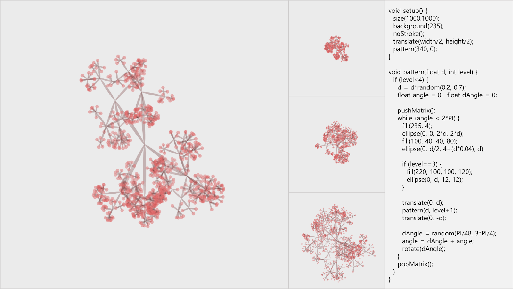
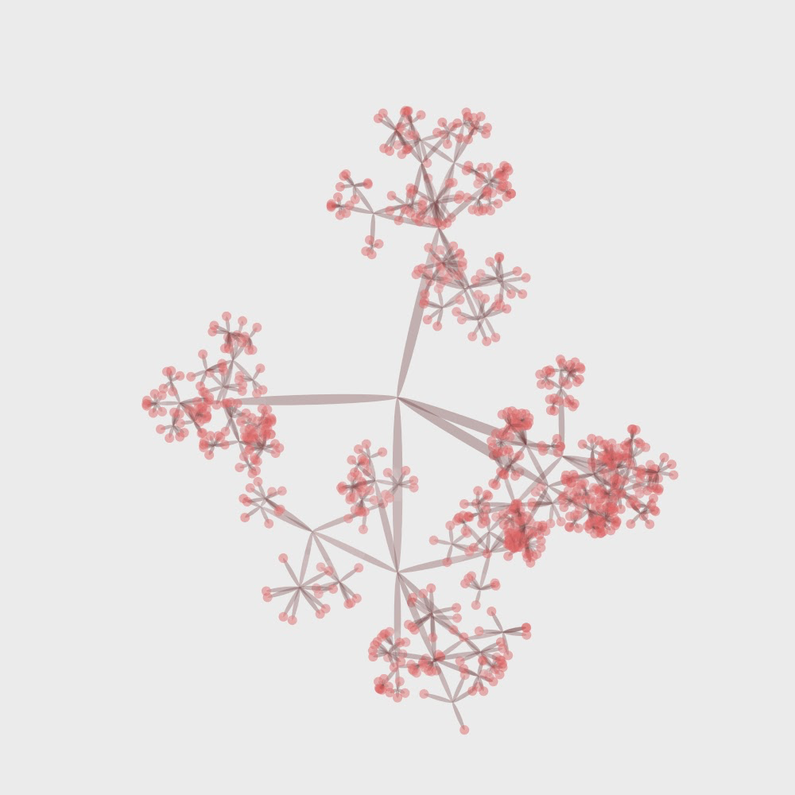
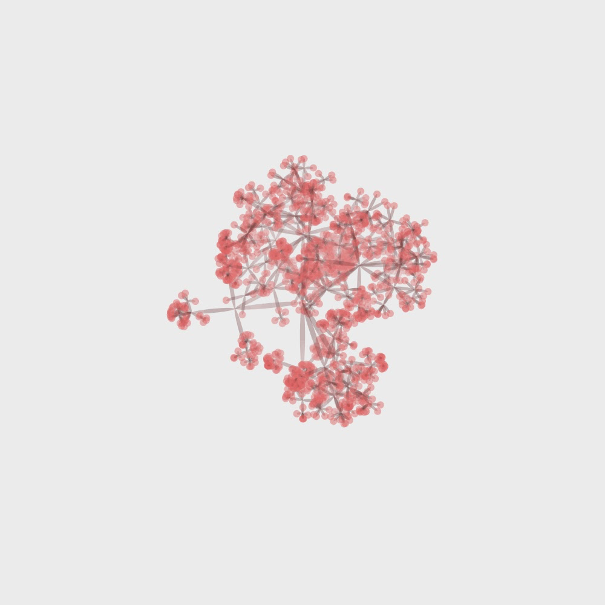
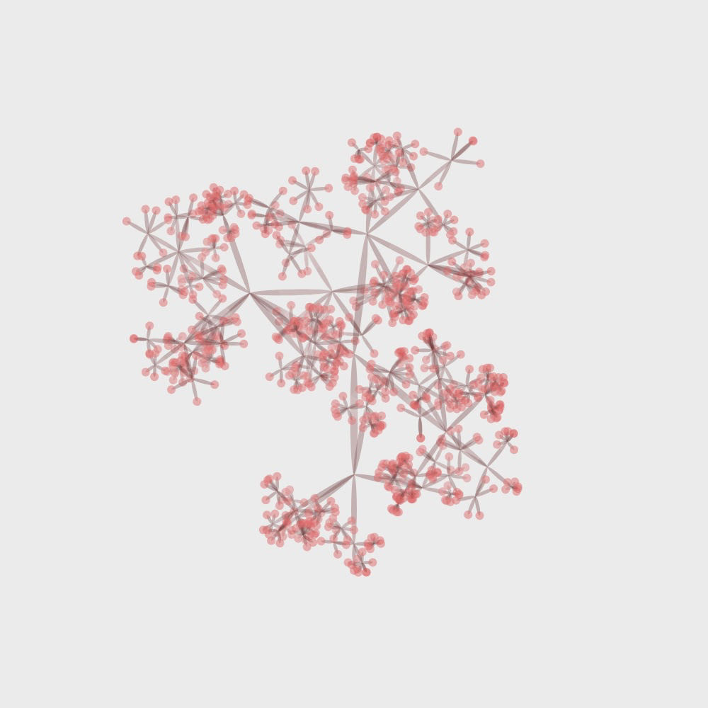
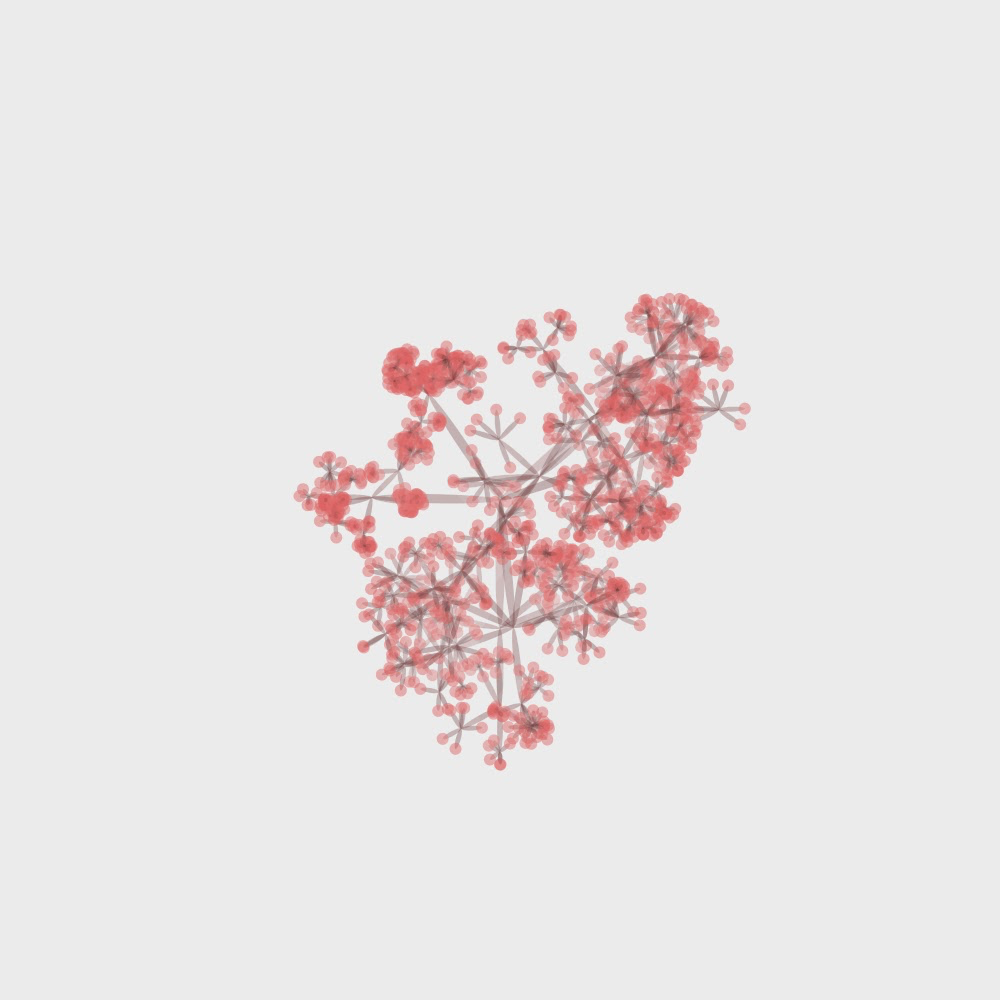

# Recursive Blossom

Processing을 활용하여 제작한 재귀적 패턴으로 생성한 Generative Art 프로젝트입니다.

## 프로젝트 설명

이 프로젝트는 재귀(Recursion) 알고리즘을 활용하여 자연스러운 꽃 패턴을 생성합니다. 재귀는 프로그래밍에서 함수가 자기 자신을 호출하는 것을 의미하며, 이를 통해 복잡한 패턴이나 프랙탈 구조를 효율적으로 만들 수 있습니다.

Processing은 시각적 아트와 인터랙티브 미디어를 위한 프로그래밍 언어이자 개발 환경으로, 특히 창의적인 코딩과 제너레이티브 아트 작업에 적합합니다. 이 프로젝트에서는 Processing의 그래픽 기능을 활용하여 유기적인 형태의 꽃 패턴을 구현했습니다.

관심이 있으시다면 언제든 연락 주시기 바랍니다!

원문: [https://randomflik.blogspot.com/2017/10/recursive-blossom-by-processing.html](https://randomflik.blogspot.com/2017/10/recursive-blossom-by-processing.html)
