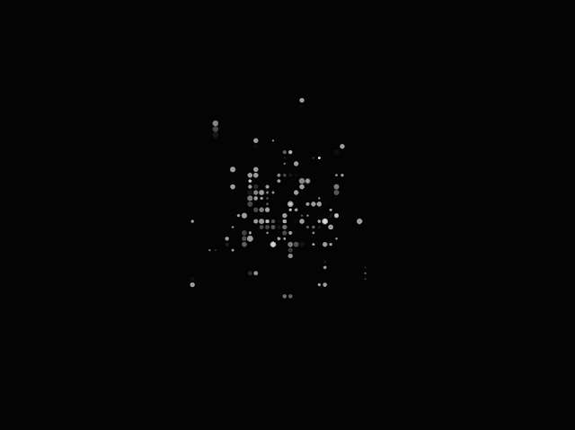
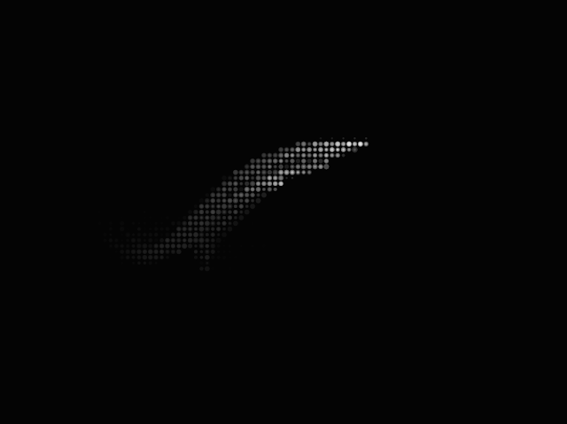
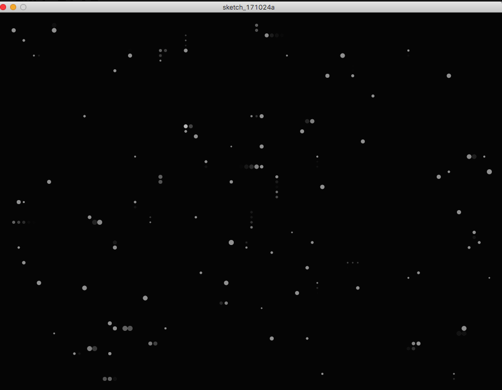

Processing을 사용하여 2D 그리드 상에서 마우스 인터랙션에 반응하는 파티클 시스템을 구현한 작품입니다.

영상: [https://youtu.be/YlJwedHB5qA](https://youtu.be/YlJwedHB5qA)

## 주요 기능

- 2D 그리드 상에서 움직이는 100개의 파티클 객체
- 마우스 드래그에 따른 파티클 이동
- 마우스 클릭/릴리즈에 따른 파티클 위치 저장 및 복원
- 부드러운 모션을 위한 선형 보간(lerp) 적용
- 그리드 기반 위치 정렬

## 소스 코드

```processing
object[] OB = new object[100];

void setup() {
  size(1000, 750);
  background(20);
  noStroke();
  for (int i =0; i < OB.length; i++) {
    OB[i] = new object();
  }
}

void draw() {
  fill(0, 30);
  rect(0, 0, width, height);
  for (int i =0; i < OB.length; i++) {
    OB[i].update();
    OB[i].drawObj();
  }
}

void mouseDragged() {
  for (int i =0; i < OB.length; i++) {
    OB[i].attraction(mouseX, mouseY);
  }
}

void mousePressed() {
  for (int i =0; i < OB.length; i++) {
    OB[i].pushPosition();
    OB[i].attraction(mouseX, mouseY);
  }
}

void mouseReleased() {
  for (int i =0; i < OB.length; i++) {
    OB[i].popPosition();
  }
}

class object {
  float rate = 0.1;
  float size = 10;
  float destinationX = width/2;
  float destinationY = height/2;
  float previousX;
  float previousY;
  float positionX = width/2;
  float positionY = height/2;
  color fillcolor;
  int grid= 5;

  object() {
    destinationX = random(0, width);
    destinationY = random(0, height);
    rate = random(0.05, 0.2);
    size = grid*0.5 + grid * random(0, 1) * 1.5;
    fillcolor = color(255, 40);
  }

  void drawObj() {
    positionX = grid + 2*grid* int(lerp(positionX, destinationX, rate)/(2*grid));
    positionY = grid + 2*grid* int(lerp(positionY, destinationY, rate)/(2*grid));
    fill(fillcolor);
    ellipse(positionX, positionY, size, size);
  }

  void update() {
    destinationX += random(-grid, grid);
    destinationY += random(-grid, grid);
    destinationX = constrain(destinationX, 0, width);
    destinationY = constrain(destinationY, 0, height);
  }

  void pushPosition() {
    previousX = positionX;
    previousY = positionY;
  }

  void popPosition() {
    destinationX = previousX;
    destinationY = previousY;
  }

  void attraction(float pointX, float pointY) {
    destinationX = pointX;
    destinationY = pointY;
  }
}
```

## 구현 설명

이 작품은 Processing을 사용하여 만든 인터랙티브 파티클 시스템입니다. 각 파티클은 그리드 상에서 움직이며, 마우스 인터랙션에 반응합니다.

주요 구현 포인트:

1. 그리드 시스템을 통한 위치 정렬
2. lerp 함수를 활용한 부드러운 모션
3. 마우스 인터랙션에 따른 상태 관리
4. 반투명 파티클을 통한 시각적 효과

원문: [Objects in 2D grid / Processing](https://randomflik.blogspot.com/2017/10/objects-in-2d-grid-processing.html)
