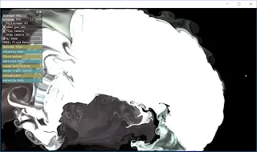
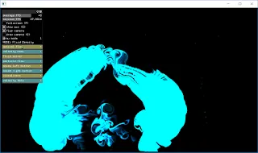

위 스크린샷과 같이 `ftVelocityMaskShader.h` 파일에 있는 `glTwo()`에서 `gl_FragColor`을 수정해서 색깔을 바꾸는데 성공했다.

## 기존 색깔과 변경된 색깔

`gl_FragColor = vec4(alpha*0, alpha*120, alpha*200,1);` 로 했을 때의 색깔.

## 응용

x축 방향의 변화는 Green 색깔을 일으키며, y축 방향의 변화는 Red 색깔을 일으키도록 했다.

frag, vert 파일에 해당하는 파일이 ofxFlowTools에서는 `~~~Shader.h` 파일로 만들어져 있다.

Shader와 openCV에 대한 공부를 병행하고 있긴 하지만 아직 완전히 파악하지는 못하고 있다.
이렇게도 해보고 저렇게도 해보면서 조금씩 앞으로 가고 있는 중.

원문: [https://randomflik.blogspot.com/2017/04/offlowtools.html](https://randomflik.blogspot.com/2017/04/offlowtools.html)
