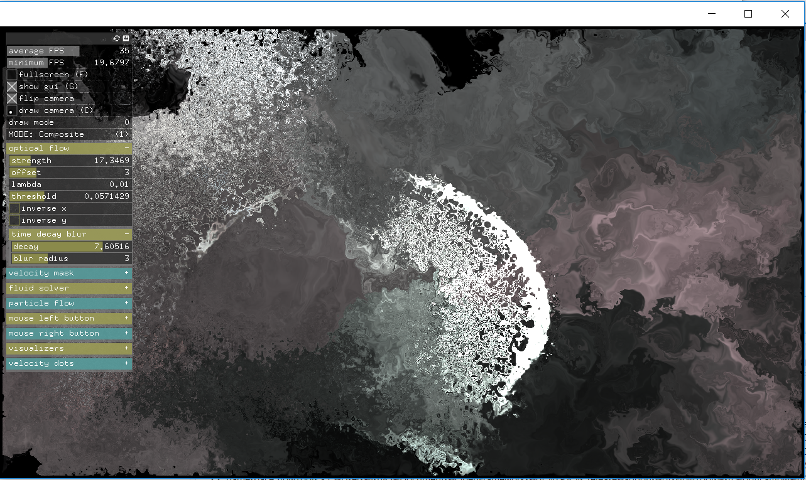
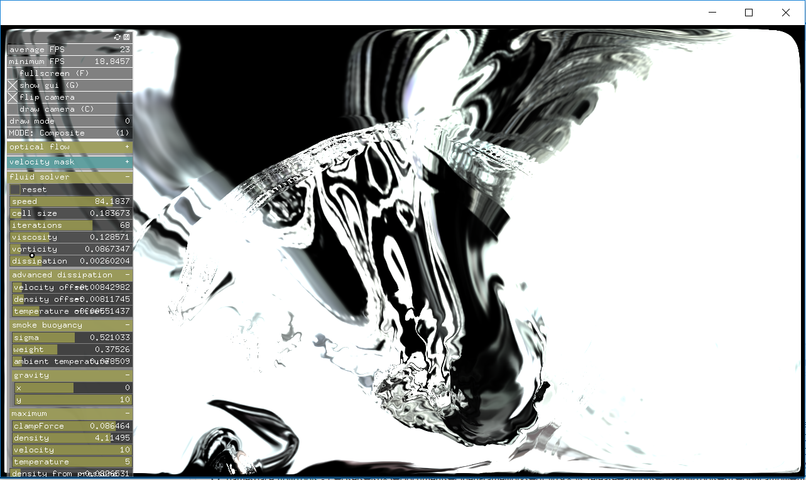

openCV의 optical fluid를 openframeworks에서 활용할 수 있도록 만들어진 애드온이다.
암스테르담의 아티스트이자 소프트웨어 개발자인 Matthias Oostrik가 만들었다.

애드온에 포함되어있는 GUI example을 실행시키면,  
연결된 카메라로 촬영되는 영상을 fluid로 변환해서 나타내주는 프로그램이 실행된다.
GUI 인터페이스로 이것저것 조작이 가능하다.

그러나 조작하는데에 몇가지 한계가 있다.
내가 못찾았는지도 모르겠지만 일단 아래와 같은 점은 실패했다.

1. 색깔을 바꾸는것
2. 프레임을 샘플링하는 시간 간격(?) 조절
3. Velocity Map을 fluid가 아닌 다른 형태로 나타내는것

### 관련 링크

Forum:  
[https://forum.openframeworks.cc/t/ofxflowtools-optical-flow-fluid-dynamics-and-particles-in-glsl/15470/26](https://forum.openframeworks.cc/t/ofxflowtools-optical-flow-fluid-dynamics-and-particles-in-glsl/15470/26)

Git:  
[https://github.com/moostrik/ofxFlowTools1.0k](https://github.com/moostrik/ofxFlowTools1.0k)

Matthias Oostrik:  
[http://www.matthiasoostrik.com/](http://www.matthiasoostrik.com/)

원문: [https://randomflik.blogspot.com/2017/04/ofxflowtools.html](https://randomflik.blogspot.com/2017/04/ofxflowtools.html)
