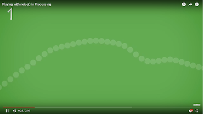
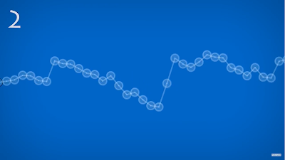
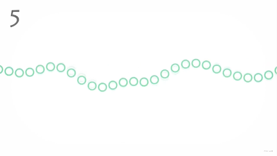
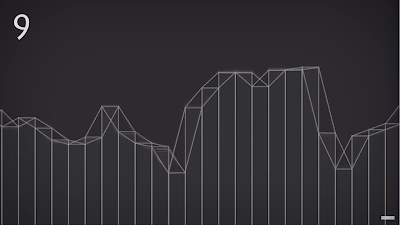

### About

프로세싱의 `noise()` 함수를 활용하여 만든 영상입니다.

`noise()`는 perlin noise값을 생성하는 함수입니다.
랜덤한 변수를 생성해주는데 random()이라는 함수와 다르게 주변 값과 자연스럽게 연결되는 값을 생성해 주는게 특징입니다.

1차원,2차원,3차원까지 표현이 가능합니다.
영상에 있는 것은 모두 1차원 Perlin noise를 활용한 것입니다.

[영상 보기](https://youtu.be/GRMAaLLZS_o)

### Perlin Noise란?

펄린 노이즈(Perlin Noise)는 텍스처 효과를 위해 개발된 절차적 노이즈 함수입니다.

펄린 노이즈의 주요 특징은 다음과 같습니다:

1. 자연스러운 연속성

- 인접한 값들 사이에 급격한 변화가 없어 부드러운 변화를 만들어냅니다
- 이는 자연에서 발견되는 패턴과 유사한 결과를 만듭니다

2. 예측 가능한 무작위성

- 완전한 랜덤과 달리 일정한 패턴을 가지고 있어 제어가 가능합니다
- 같은 입력값에 대해 항상 동일한 출력값을 반환합니다

3. 다차원 확장성

- 1D, 2D, 3D 등 다차원으로 확장이 가능합니다
- 각 차원에서도 일관된 특성을 유지합니다

주요 활용 분야:

- 지형 생성
- 텍스처 생성
- 애니메이션 효과
- 프로시저럴 콘텐츠 생성
- 게임의 자연스러운 움직임 구현

펄린 노이즈는 현대 컴퓨터 그래픽스와 게임 개발에서 필수적인 알고리즘 중 하나로 자리잡았습니다.
