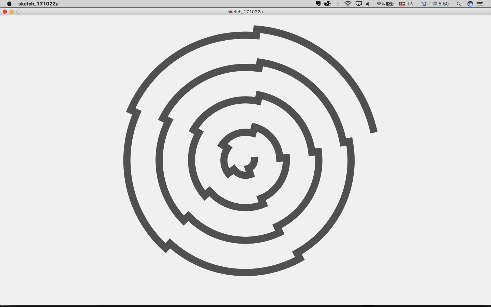
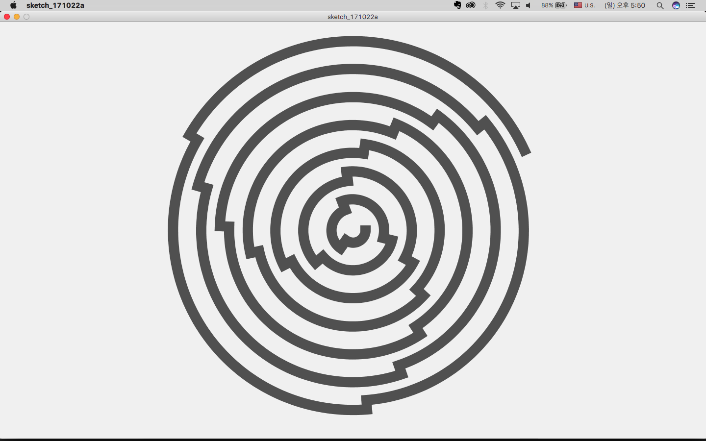
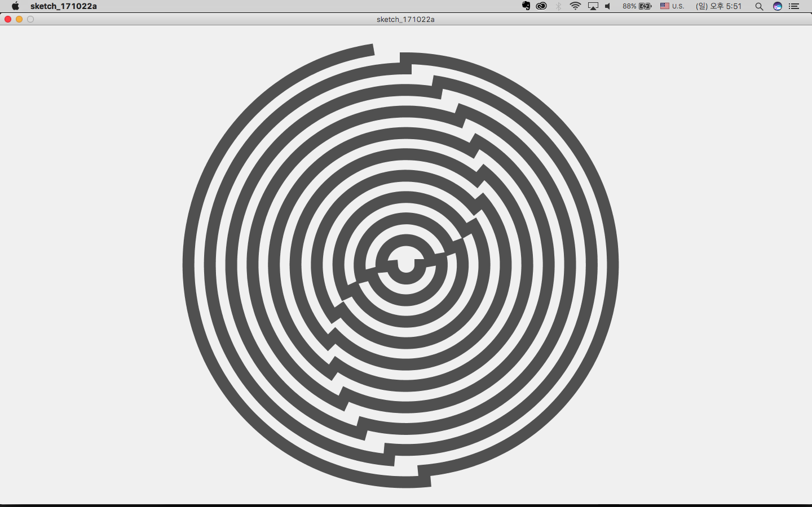
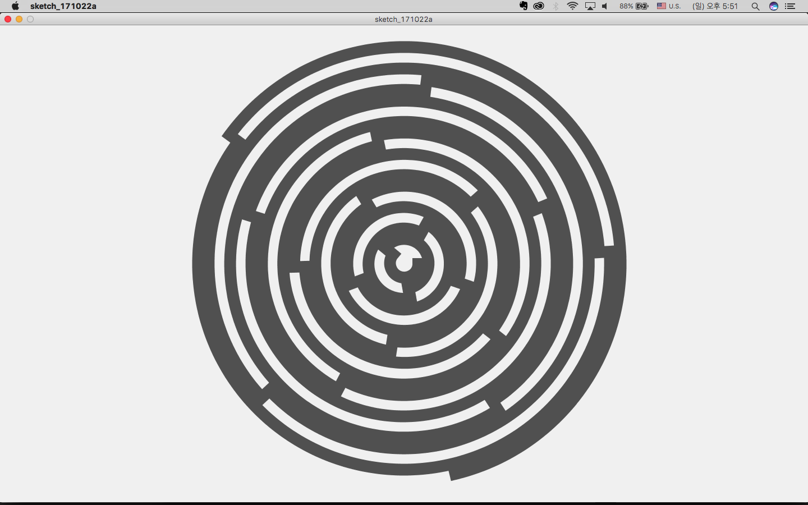
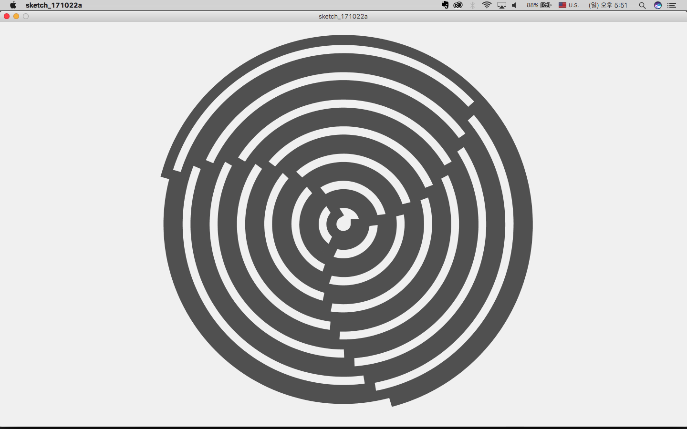

Processing을 활용하여 재귀적 패턴의 아크(arc)를 그리는 작업을 진행했습니다. 이 작업은 재귀 함수를 활용하여 점점 커지는 원호를 그리면서 회전하는 패턴을 만들어냅니다.

## 소스 코드

```processing
float theta;
float a = 4;

void setup() {
  size(1440, 850);
}

void draw() {
  background(240);
  frameRate(120);
  noFill();
  stroke(80);
  strokeWeight(21);
  strokeCap(PROJECT);
  translate(width/2, height/2);

  if (a>500){
    a = 0;
  }
  a += 0.0625;
  theta = radians(a);

  pushMatrix();
  drawArc(theta, 50);
  popMatrix();
}

void drawArc(float h, float r) {
  if (r < height-50) {
    arc(0, 0, r, r, 0, h);
    rotate(theta);
    drawArc(h, r+38);
  }
}
```

## 코드 설명

재귀적 패턴을 활용한 작업입니다. 간단한 코드로 흥미로운 패턴을 만들어냅니다.
`drawArc` 함수는 재귀적으로 호출되면서 점점 커지는 원호를 그립니다.

주요 매개변수들:

- `theta`: 회전 각도를 라디안 값으로 저장
- `a`: 각도 증가값 (4에서 시작하여 점진적으로 증가)
- `r`: 원호의 반지름 (호출될 때마다 38씩 증가)

재귀 호출은 원호의 크기가 화면 높이에 거의 도달할 때까지 계속되며, 이는 `if (r < height-50)` 조건문으로 제어됩니다. 각 프레임마다 전체 패턴이 다시 그려지면서 동적인 애니메이션이 만들어집니다.

이러한 재귀적 패턴의 코드는 복잡한 기하학적 패턴을 간단한 규칙으로 만들어낼 수 있다는 점에서 효과적입니다. Processing을 활용하면 이러한 패턴을 시각적으로 즉시 확인할 수 있어 코딩을 통한 예술적 표현을 쉽게 경험할 수 있습니다.

원문: [https://randomflik.blogspot.com/2017/10/171022-processing-work.html](https://randomflik.blogspot.com/2017/10/171022-processing-work.html)
