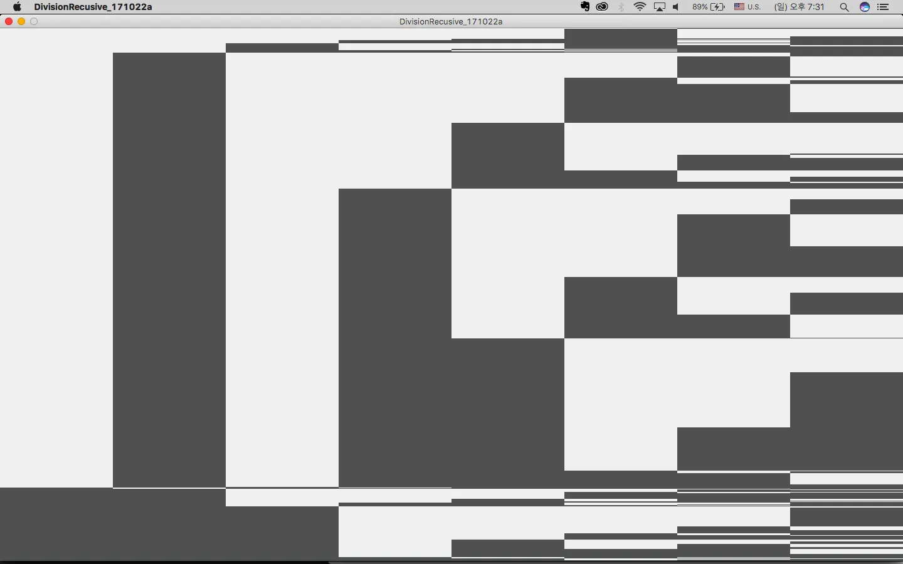
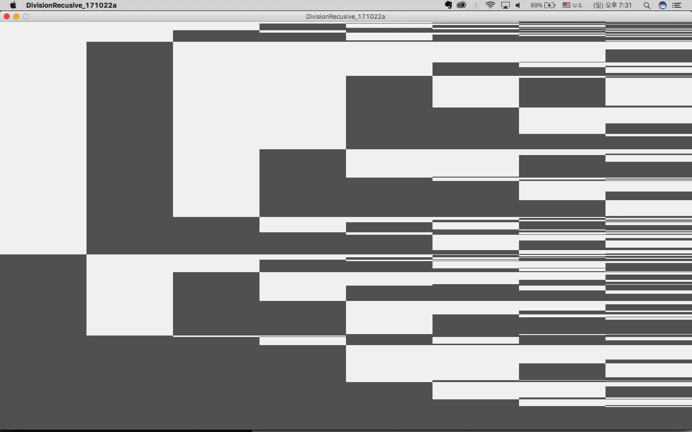
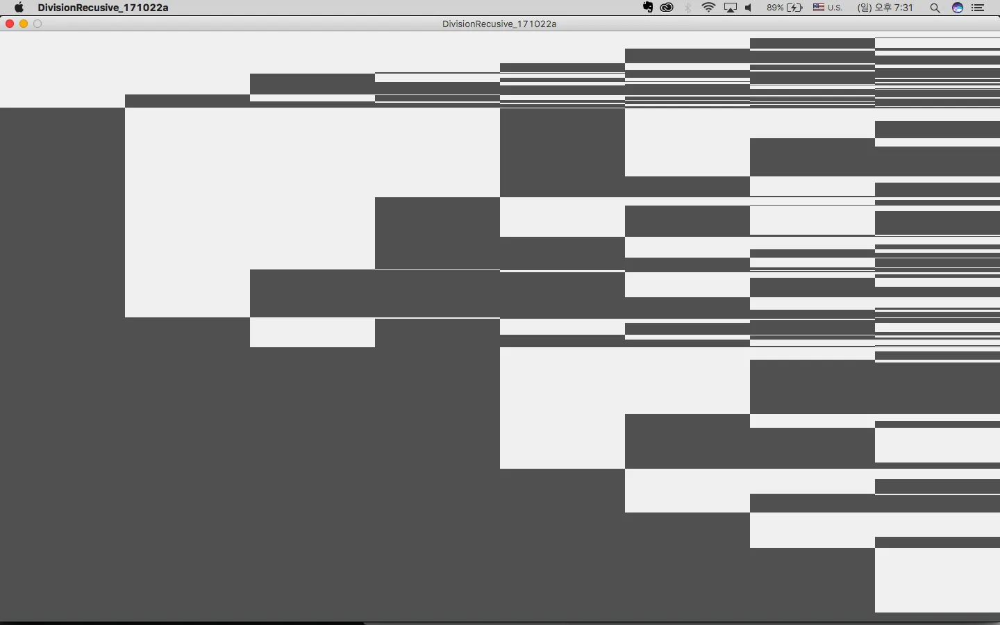

Processing을 활용하여 재귀적 패턴 연습.
화면을 수직으로 분할하고, 각 분할된 영역을 다시 재귀적으로 분할하여 디지털을 나타내는 시각적 패턴을 만들어냅니다.

```processing
float theta;
float a = 4;

void setup() {
  size(1440, 850);
  background(255);
  frameRate(4);
  noStroke();
  drawdivision(0, 0, 180, height);
}

void draw() {
}

void keyPressed() {
  background(255);
  drawdivision(0, 0, 180, height);
}

void drawdivision(int x, int y, int w, int h) {
  float division = random(0, 1);
  int d = int(h*division);
  if (x<width) {
    fill(240);
    rect(x, y, w, d);

    fill(80);
    rect(x, y + d, w, h- d);

    x = x+ w;
    drawdivision(x, y, w, d);
    drawdivision(x, y + d, w, h- d);
  }
}
```

이 코드는 재귀적 패턴의 기본적인 예제를 보여줍니다. `drawdivision` 함수는 재귀적으로 호출되어 화면을 계속해서 분할합니다. 각 분할은 랜덤한 비율로 이루어지며, 이는 `random(0, 1)`을 통해 결정됩니다.

재귀적 패턴의 특징은 다음과 같습니다:

1. 자기 자신을 호출하는 패턴을 가집니다
2. 종료 조건이 명확해야 합니다 (이 경우 `x < width`)
3. 각 재귀 호출마다 문제의 크기가 줄어듭니다 (이 경우 높이가 분할됨)

키를 누르면 새로운 패턴이 생성되어, 매번 다른 모양의 분할 패턴을 관찰할 수 있습니다. 이러한 재귀적 패턴은 자연에서도 자주 발견되며, 프랙탈 구조나 나뭇가지의 성장 패턴 등을 시뮬레이션하는 데에도 활용될 수 있습니다.

원문: [171022 Processing Work_02](https://randomflik.blogspot.com/2017/10/171022-processing-work02.html)
