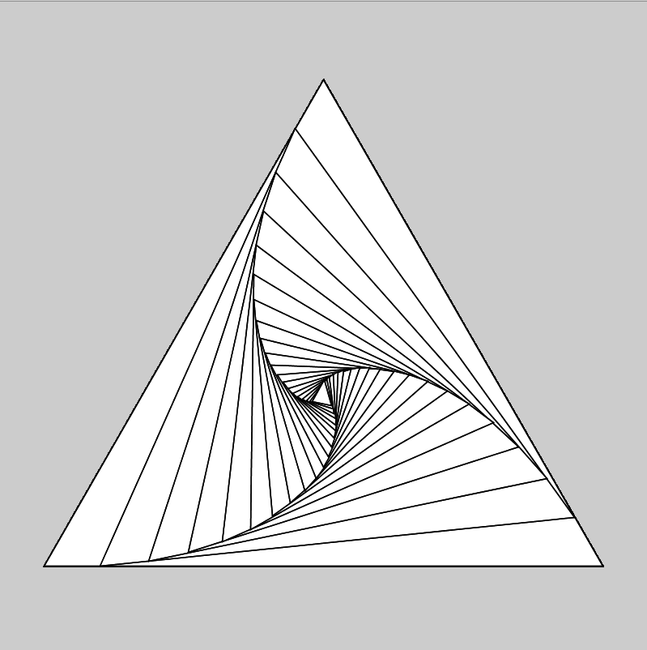
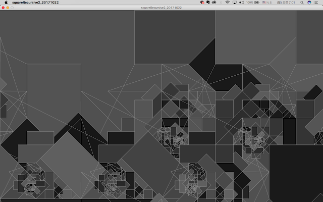
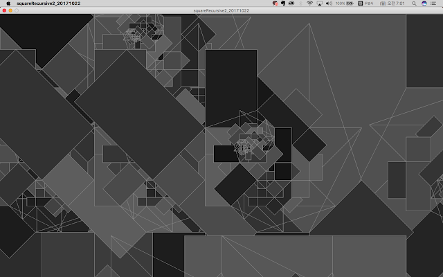
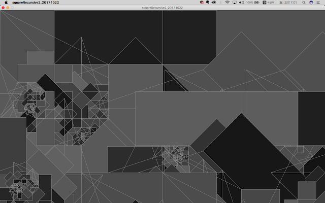
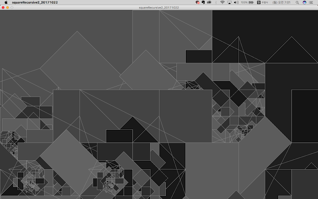

## 재귀적 삼각형 패턴



Processing을 활용한 재귀적 패턴의 작업입니다.

재귀 함수는 자기 자신을 호출하는 함수로, 이를 활용하면 복잡한 패턴을 간단한 코드로 표현할 수 있습니다. 이 작업에서는 하나의 큰 삼각형 내부에 더 작은 삼각형들이 반복적으로 생성되는 패턴을 구현했습니다. 각 단계에서 삼각형의 꼭지점들을 9:1의 비율로 내분하여 새로운 삼각형을 그리는 방식으로 작동합니다.

```processing
void setup() {
 size(800, 800);
}

void draw() {
 translate(width/2, height*0.12);
 scale(1.5);

 recursive(0, 0, -int(width*0.5/sqrt(3)), height/2, int(width*0.5/sqrt(3)), height/2, 0);
}

void recursive(int x1, int y1, int x2, int y2, int x3, int y3, int l) {
 if (l<20) {
   triangle(x1, y1, x2, y2, x3, y3);

   int a=9;
   int b=1;
   recursive((a*x1+b*x2)/(a+b), (a*y1+b*y2)/(a+b),
            (a*x2+b*x3)/(a+b), (a*y2+b*y3)/(a+b),
            (a*x3+b*x1)/(a+b), (a*y3+b*y1)/(a+b), l+1);
 }
}
```

원문: [https://randomflik.blogspot.com/2017/10/recursive-triangleprocessing.html](https://randomflik.blogspot.com/2017/10/recursive-triangleprocessing.html)

## 스크램블된 사각형 패턴



이번에는 재귀를 활용하여 사각형을 기반으로 한 패턴을 만들어보았습니다. 화면을 일정한 크기의 격자로 나누고, 각 격자 안에서 재귀적으로 회전된 사각형들을 그려냅니다. 각 사각형은 랜덤한 각도로 회전되며, 내부에 더 작은 사각형들이 재귀적으로 생성됩니다.





```processing
void setup() {
 size(1440, 860);
 background(80);
 int size = width/5;
 for (int y=0; y < height; y += size+0) {
   for (int x=0; x < width; x += size+0) {
     pushMatrix();
     translate(x+size/2, y+size/2);
     rotate(PI/2 * int(random(0, 4)));
     translate(-size/2, -size/2);
     tile(size, 0, 0, 0);
     popMatrix();
   }
 }
}

void draw() {
}

void tile(float size, float x, float y, int level ) {
 if (level<5) {
   pushMatrix();
   translate(x, y);

   noStroke();
   fill(int(random(20, 100)), 255);
   rect(0, 0, size, size);

   stroke(140);
   strokeWeight(3);
   line(0, 0, size/3, 0);
   line(2*size/3, 0, size, 0);
   line(0, size, size/3, size);
   line(2*size/3, size, size, size);
   line(0, 0, size/2, size/2);
   line(0, size, size/2, size/2);
   line(size, 0, size, size);

   pushMatrix();
   translate(1*size/3, 0);
   rotate(PI/2);
   tile(size/3, 0, 0, level + 1);
   popMatrix();

   pushMatrix();
   translate(0, size);
   rotate(-PI/2);
   tile(size/3, 0, 0, level + 1);
   popMatrix();

   pushMatrix();
   translate(size, 2*size/3);
   rotate(PI);
   tile(size/3, 0, 0, level + 1);
   popMatrix();

   popMatrix();
 }
}
```

원문: [https://randomflik.blogspot.com/2017/10/scrambled-rectanglesprocessing.html](https://randomflik.blogspot.com/2017/10/scrambled-rectanglesprocessing.html)
