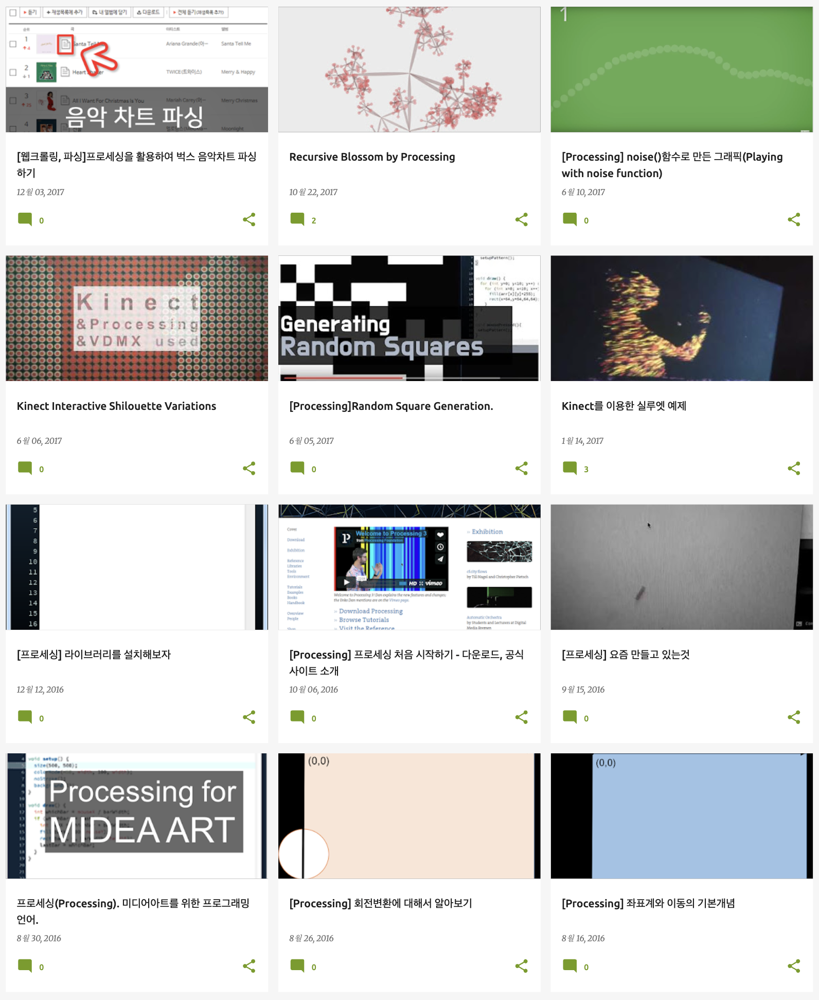

2017년에 썼던 글을 현재 블로그로 많이 옮겨왔다.

기존에 blogspot에 썼던 글인데 대부분 미디어아트 기술에 빠져있던 시절이라, Procesing, Kinect, Arduino 같은 글들이 많았다.

그 때 썼던 글들을 보니 새삼 기록의 중요성을 깨닫는다.

매일같이 쓰지는 못했지만 그때 기록했던 것들이 이제와서 보니 참 소중하다.

개발 일지를 어떻게 써야 하나 생각했는데 당시 기록을 보고 배웠다.

요즘은 완성된 형태의 개발이 아니라면 왠지 내 밑천을 드러내는 것 같아서 꺼리게 되는데 그 당시에는 그런게 없다보니 시행착오의 기록들을 남기는게 습관처럼 되어있었던 것 같다.

글보다는 간단히 "~를 해보았다" 와 함께 스샷이나 영상을 첨부하는 것만으로도 되돌아보니 기록의 가치가 있다.
