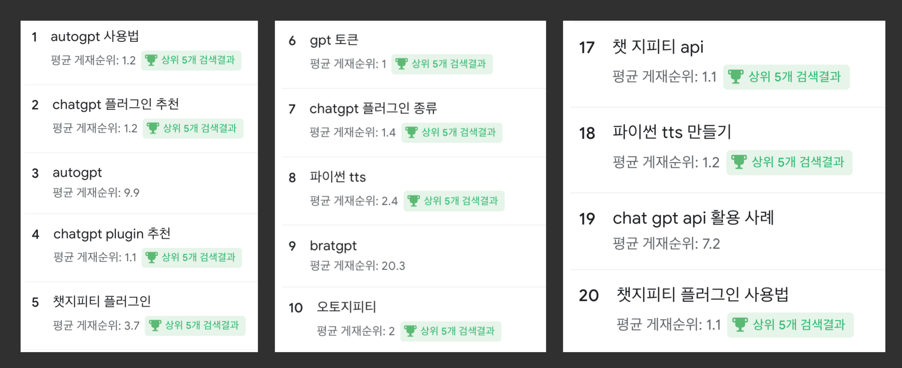
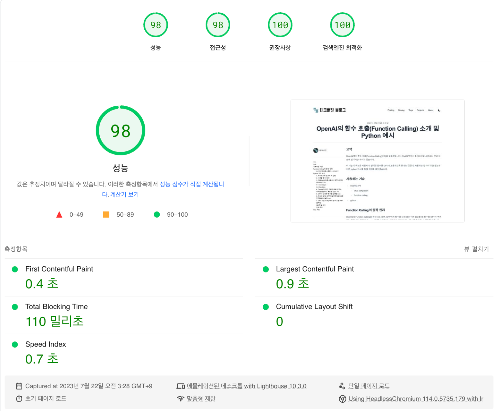
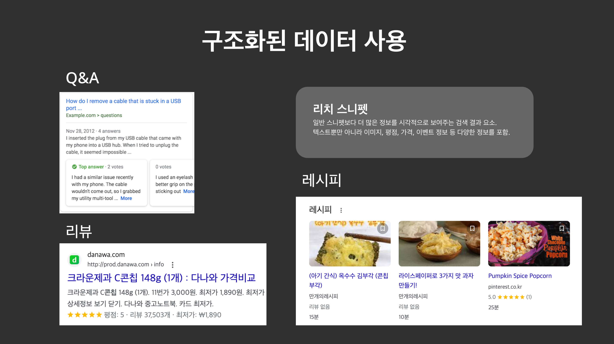
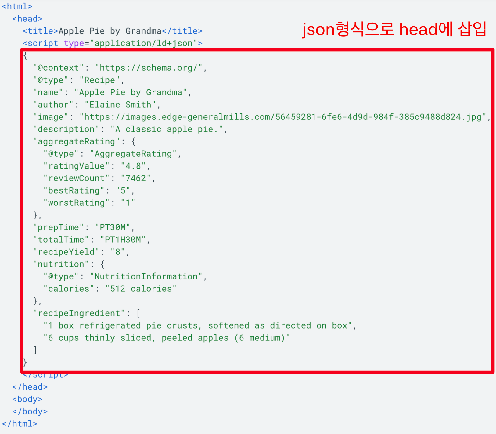
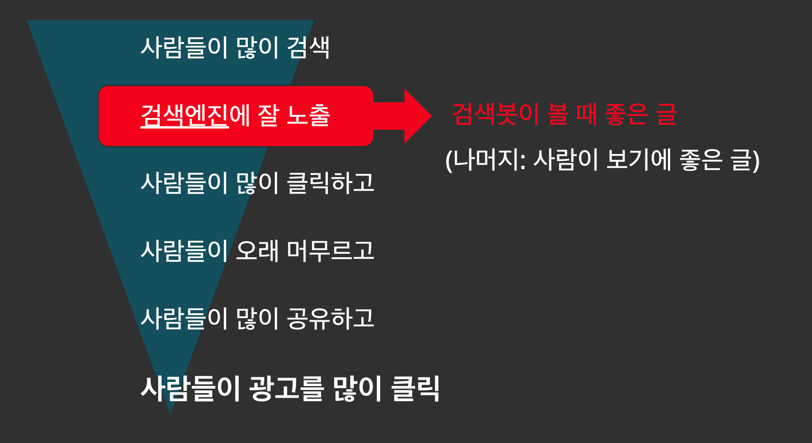

```
기술블로그를 직접 만들어 SEO를 한땀한땀 적용해보고, 실제 검색 결과로 반영되는 것들을 몸소 느껴보면서 알게된 것도 있고, 나만의 전략이 생겼다. 생각과 경험들을 정리해보고 싶었다. 막상 내용을 써보니, 글 하나로 모든 이야기를 정리하는 것은 생각보다 쉽지 않은 일이다. 성에 차지는 않지만 나름의 기록으로 이 글을 남겨본다.
```

## 요약

다음과 같은 활동 및 전략을 통해 SEO 성과를 개선하고, 방문자 수와 상위 노출 키워드를 달성했습니다.

1. **기술 블로그 제작**: 직접 기술 블로그를 만들어 SEO를 적용하고 성과를 측정했습니다.
2. **SEO의 중요성 인식**: 검색엔진을 통한 유입의 중요성을 강조하고, SEO가 유저와의 접점을 만드는 강력한 도구임을 인식했습니다.
3. **공식 문서 기반 전략**: 구글 검색센터와 같은 공식 문서를 참고하여 신뢰할 수 있는 SEO 전략을 수립했습니다.
4. **자동화 도입**: SEO 작업을 자동화하여 효율성을 높였습니다. 예를 들어, `slug`를 기반으로 `canonicalUrl`을 자동 설정하고, 메타 태그를 한 컴포넌트에서 처리했습니다.
5. **이미지 최적화**: 이미지를 최소화하고, 필요한 경우 WebP 포맷을 사용하며 lazy loading을 적용했습니다.
6. **성능 최적화**: 페이지 로딩 속도를 개선하기 위해 SSG 방식을 채택하고, 불필요한 스크립트를 제거했습니다.
7. **콘텐츠 품질 향상**: 구조화된 구성과 관련성 높은 링크를 통해 콘텐츠의 품질을 높였습니다.

---

## SEO의 가치와 중요성

새로운 서비스나 제품을 출시할 때 중요한 것 중 하나가 유저가 유입되는 경로이다. 아무리 훌륭한 서비스라도 유저가 그 존재를 모른다면 의미가 없다. 주로 유료 광고를 집행하거나 소셜 미디어 마케팅을 통해 인지도를 높이는 시도가 많은데 사람들이 간과하는 중요한 접점이 있는데 바로 **검색엔진**이다. 검색엔진은 비용 투자 없이도 유저와 서비스를 연결하는 강력한 접점이다. SEO는 검색 결과에서 사이트가 상위에 노출되고, 유저가 사이트를 찾을 확률을 높여준다.

SEO는 개발자가 담당하는 영역이라기보다는 사실 기획자나 마케터가 더 많이 신경써야 하는 일이기도 하다. 그래도 SEO는 매우 중요하고 개발자의 도움 없이는 달성하기 어려운 것도 사실이기 때문에, SEO에 대한 지식과 경험이 있는 나같은 개발자가 큰 도움이 될 수 있다는 것을 이 글을 통해 살짝 어필하고 싶었다.

---

## 기술 블로그 직접 만들기

SEO를 본격적으로 경험한 것은 기술 블로그를 직접 만들어보면서였다. 당시에 회사에서 SEO 업무를 처리하면서 관련 지식을 접하던 중, 기존 사이트의 SEO가 생각보다 잘 되어있지 않은 경우도 많이 보고, 애드센스를 통한 부수입을 가져다 줄 프로젝트를 만들고 싶은 개인적인 욕심도 더해지면서 블로그 제작을 시작하게 되었다.

### 기존 플랫폼의 한계

많은 블로그 플랫폼이 이미 존재하지만, 실제로 lighthouse같은 성능 측정 도구로 분석을 해보면 각 사이트마다 기본적으로 실행되는 스크립트가 있어서 페이지 로딩 시간 단축에는 한계가 있었다. 티스토리와 같은 플랫폼은 상대적으로 SEO가 잘 되어 있는 편이지만, 플랫폼의 기본 기능과 광고 로딩에서 Block이 많이 되고 성능 측면에서는 제약이 있었다.
블로그 플랫폼이 아닌 타 기업의 기술 블로그만 봐도 저마다의 기본동작을 로딩하는 동작이나 SEO 측면에서 부족한 부분이 괘 많은걸 보면서 그냥 직접 사이트 만들어서 할수 있는 SEO를 다 적용하면 그 사이트가 잘 되지 않을까 라고 생각을 막연히 하게 되었다.

콘텐츠에 대한 품질은 '기본 이상' 을 목표로 잡고, 나머지 테크니컬 SEO를 충족하면 성과가 좋을 거라는 생각이 들어서 일단 한번 해보기로 한 것이었다.

### 성과

기술 블로그를 약 1년정도 열심히 글을 올렸는데, 아주 많은 글을 올리지 않았는데도 불구하고 상위 노출 키워드를 많이 달성할 수 있었다. 그 외에도 소소한 수익 창출과 월 8천명 이상의 방문자 수를 달성했다.



## SEO의 기준은 공식 문서

SEO에 대해서는 각종 소문이 많다. 검색 노출에 대한 근거가 알려진 것보다 훨씬 복잡하기도 하고, 검색엔진 회사들이 알고리즘을 명확하게 공개하지 않기 때문일 것이다.

사실 소문이 다 틀렸다고 생각하지는 않는다. 나 또한, 사실 검색 문서에 없지만, 왠지 이렇게 했을때 노출이 잘되더라는 개인적인 경험과 믿음에 따라 적용하는 것도 있다.

~하면 좋더라라는 형식의 정보는 많아서 나는 가능하면 [구글 검색센터](https://developers.google.com/search/docs?hl=ko)의 문서를 통해 근거를 찾아보려고 했다.

공식 문서를 숙지하면서 가장 좋은 것은, 단순한 추측보다 신뢰할 수 있기 때문에 내가 세운 전략에 대해서 신뢰를 가지고 전폭적으로 추진할 수 있다는 점이다. 그리고 남들이 이건 몰랐겠지? 라고 생각될만한 것들을 이해하는데서 오는 쾌감도 있다.

구글 검색 센터 말고도 [네이버 서치어드바이저](https://searchadvisor.naver.com/guide), [PageSpeed Insights](https://pagespeed.web.dev/) 같은 신뢰도가 높은 문서들을 참고했다.

공식적인 근거를 찾기 어려운 부분에 대해선, 검색엔진의 목표는 "사용자에게 유익한 컨텐츠를 제공하는 것" 이라는 가정 하에(뇌피셜) 유효하다고 생각되는 전략들을 취했다.

### 하지 않은 것들

내가 **하지 않은 것**도 있는데, 대표적인 예가 다음과 같다.

- **인위적인 백링크**: 외부 블로그나 커뮤니티에 무의미한 링크를 퍼뜨리는 행위는 검색엔진이 더 이상 긍정적으로 보지 않는다고 생각했다.
- **과도한 이미지 삽입**: 이미지를 많이 넣어야 SEO에 좋다는 말도 있지만 많은 이미지를 넣는 것은 지양했다.
- **도메인 권위(Domain Authority)** 에 집착하지 않았다. 대신 URL 구조와 **키워드 일치**에 더 집중했다.

## 남들 다 하는 SEO는 나도 하기

보통 사람들이 SEO 한다고 할 때 하는 일들이 있다. 예를 들어 title, desciption 같은 기본적인 meta 태그, OpenGraph, 사이트맵, robots.txt, 이미지 태그에 alt 속성 추가하기 등.

이런 것들은 중요하다는 건 알지만, 막상 하려면 부지런해야 하고 빼먹기가 쉬운데 검사 도구와 자동화를 통해 좀더 철저하게 효율적으로 적용할 수 있다.

### 검사 도구 활용하기

Lighthouse, pagespeed.web.dev에서는 이런 기본적인 것들을 꽤 잘 체크해준다.
Lighthouse에서 체크해주는 기준은 가능하면 통과하도록 만드는게 좋은데

실제로 해보면 태그에 간단히 내용을 채워서 해결할 수 있는 항목이 있는 반면, 스크립트 로딩, 이미지 로딩 등에서 지연되는 항목을 바로 해결하긴 어렵다. 나의 경우에는 일단 채울 수 있는 것부터 다 달성되게 만들고, 기술적인 해결이 필요한 것들은 하나씩 따로 해결했다.



## 자동화

글을 하나 쓸때마다 자잘한 항목들을 채우는 것은 생각보다 많이 번거롭기 때문에 **최대한 자동화** 를 구축해서 목표를 달성하려고 했다.

최소한의 정보를 작성하면 같은 정보를 여기저기 중복으로 작성하지 않아도 SEO가 적용되도록 했다.

예를 들면 `slug`를 frontmatter에서 지정한 경우, `cannonicalUrl`도 함께 지정되게 하고,
`<title/>`과 `<meta name="og:title"/>` `<meta name="title"/>` `<meta name="twitter:title"/>` 처럼 동일한 내용인 경우는 SEO를 처리하는 한 컴포넌트에서 모두 해결되게 했다.

그 외에도

- 빌드할 때 sitemap.xml 자동 생성
- 각 페이지별로 구조화된 JSON-LD를 자동 생성하도혹 하기.
- 블로그 본문에 아무 이미지 등록시 webp로 자동 변환(Github Action)

### 리스트 업

하나씩 떼어보면 간단한 조치에 불과하지만 하나하나 확인하고 적용하려다 보면 빼먹기가 쉽다.

Lighthouse에 나오지 않는 것도 있지만 뭐 오히려 좋다고 생각한다.
남들이 채우지 않은 걸 채울수록 내 사이트의 경쟁력은 올라가기 때문이다.

- meta title
- meta description
- 오픈그래프 데이터
- description 길이 최적화
- canonical URL 설정
- keyword 태그
- 최적화된 이미지 포맷(webp 사용)
- 이미지 태그에 alt태그 추가
- 이미지 크기 명시
- 시멘틱 HTML 태그 사용
- JSON-LD 구조화 데이터 제공

---

## JSON-LD는 SEO의 꽃

"왜 어떤 사이트는 구글 검색 결과에서 정보가 더 풍부하게 나오고, 내 사이트는 그냥 밋밋할까?" 라고 궁금증을 가질 수 있다. 이런것을 **리치 스니펫** 혹은 **인리치드 결과**라고 하는데, 답은 **구조화된 데이터(JSON-LD)**에 있다.



검색결과에 '작성자', '날짜', '썸네일', '제목'이 예쁘게 나오는 이유는 그 사이트가 검색엔진에게 "이건 이런 구조의 콘텐츠야"라는 정보를 제공했기 때문이다.

정보를 제공하는 방법은 사실 간단한데 script 태그를 활용해서 json형식으로 제공하면 된다.



이렇게 JSON-LD를 제공하면 대형 사이트뿐만 아니라, 직접 만든 사이트에도 리치 결과(Rich Result)를 적용할 수 있다. 리치 리절트란 일반 검색 결과보다 더 많은 정보와 시각적 요소를 포함하는 확장된 검색 결과 형태로, 사용자의 클릭률(CTR)을 크게 향상시킬 수 있다.

아티클, 리뷰, Q&A, FAQ, 퀴즈, 레시피 등 생각보다 데이터 형식이 많은데 정보를 이걸 채워놓으면 검색결과에 이 정보가 실제로 반영된다.

나는 모든 글에 `BlogPosting` 형식의 JSON-LD를 기본으로 들어가도록 하면서, 필요시 다른 형식의 JSON-LD가 있는 경우에는 추가로 데이터를 넣을 수 있도록 만들었다.

[Google 검색의 구조화된 데이터 마크업 소개(구글 검색센터)](https://developers.google.com/search/docs/appearance/structured-data/intro-structured-data?hl=ko)에서 자세한 정보를 알아볼 수 있다.

---

## 이미지는 득보다 실이 많다

많은 사람이 SEO를 목적으로 이미지를 많이 삽입하는 전략을 이야기하기도 하는데, 나는 기본적으로 이미지는 득보다 실이 많다고 생각한다. 페이지 성능 측정을 해보면 대부분 상황에서 이미지가 로딩의 걸림돌이 되기 때문이다.

### 이미지를 빼는 것이 최고의 SEO

위와 같은 이유로, 이미지를 가능하면 넣지 않는 것이 SEO에 유리하다고 판단했다.

특히 썸네일용 이미지를 본문에 억지로 넣는 건 절대 하지 않는다. 그런 이미지는 `og:image`로만 쓰면 된다.

또 이미지를 통해 전달하는 내용이 텍스트인 경우에도 굳이 이미지일 필요가 없다. 그냥 **텍스트로 직접 제공**하면 된다. 주로 코드 예시나, ChatGPT 스크린샷 등이 있었는데 자주 사용되는 형식은 컴포넌트로 만들어서 텍스트지만 별도 디자인의 박스에 담겨서 가독성을 개선했다.

### 이미지 SEO 전략

1. **이미지를 기본적으로 넣지 않는다.**
2. **정말 필요한 경우에만 WebP로, 용량을 최소화해 삽입한다.**
3. **뷰포트 밖에 있는 이미지는 반드시 lazy loading 처리한다.**

이미지를 빼는게 자유롭지 않은 경우(ex. 회사) 이미지를 넣되, 최적화할 필요가 있다. 이런 경우에 불필요하게 큰 이미지를 넣는 대신 효율적인 이미지 포맷(webp)을 사용하고 크기, 해상도를 최소한으로만 사용했다. 이미지와 관련된 성능 최적화에 대해서는 더 할 이야기가 많아서 이 글에서는 여기까지만 다루고자 한다.

---

## 성능최적화도 SEO다

이미지 전략에서도 언급했듯이, SEO를 하다가 보면 성능 최적화의 영역까지 다룰 필요가 있다.

성능이 검색결과에 영향을 미칠까?라고 생각할 수 있는데 이에 대한 근거는 구글 검색센터에서 찾을 수 있다. **"사용자 경험이 우수한 페이지를 우선 노출한다."**는 부분이 있다. 여기서 사용자 경험은 코어 웹 바이탈과 같은 지표를 볼텐데 이것이 간단히 말하면 페이지 로딩 속도이다. (이건 내가 비약적으로 축약한 것이고 실제로 사용자경험이 의미하는 것은 다른 여러가지 요소가 있을 수 있다.)

그래서 블로그를 만들때 최적의 로딩 속도을 위해, 페이지를 빌드 시점에 정적으로 생성하는 **SSG 방식**을 채택했다.

그 외에 폰트, 이미지, 스크립트 등 로딩하는 모든 요소는 걸림돌이다. 필요 없는 스크립트는 제거하고, 필수적인 스크립트(gtag, adsense 등)도 **defer** 처리하거나, 초기 로딩에 방해되지 않도록 위치와 조건을 조절했다.

CSR 방식의 페이지라도, **메타 태그는 SSR로** 먼저 렌더링되게 처리하여 SEO 누락을 방지했다.

---

## 어떤 콘텐츠가 SEO에 유리할까? (다소 뇌피셜)

앞서 이야기한것 처럼 검색엔진의 최종적인 목표는 사용자에게 유익한 콘텐츠를 제공하는 것이다.
그러므로 내 콘텐츠가 검색엔진이 봤을 때 유익한 콘텐츠로 인식되게 하는게 중요하다고 생각했다.



### 로봇이 봤을 때 좋은 글(뇌피셜)

검색 로봇이 '좋은 콘텐츠'라고 판단하는 영역은 제한적이다. 메타태그, 제목(h 태그), 글 초반부, 본문 내 링크 정도다. 이 영역에 키워드와 핵심 정보를 배치해야 검색에 잘 걸린다. 그리고 정보가 충실하게 제공된 콘텐츠일수록 유익한 콘텐츠로 인식할 가능성이 크다. 한 사이트 및 페이지 내에서는 키워드/주제의 일관성을 유지하는 것이 사이트의 신뢰도를 높인다고 생각했다. (흔히 전문 블로그 vs 잡블로그의 비교에서 전문 블로그에 해당)

- 메타 데이터가 충실하게 채워진 경우.
- 구조화된 내용.(제목, 본문, 이미지, 링크 등의 적절한 활용)
- 내용의 일관성 좋은 경우.
- 관련성 높은 링크를 포함하는 경우

콘텐츠 품질은 검색 결과에 미치는 영향이 크지만 기준이 불분명하다.
나는 경험적으로 알게된 전략들을 글을 쓸때 활용하는데, 러프하지만 나열해본다.

- **구조화된 구성**: 제목, 소제목, 서론과 결론이 있는 글이 좋고 h태그로 모두 감싼다.
- **태그는 용도에 맞게 쓴다**. 인용 `<blockquote>`을 제목으로 쓰는 사람이 있다. 용도를 바꿔서 쓰지 않는다.
- **중요한 키워드는 글의 초반부, 메타태그, h태그 등에 자연스럽게 포함**시킨다.
- **AEO**(Answer Engine Optimization)를 위해 **질문형 문장을 도입부에** 배치한다.
- **직접 실험한 내용이나 사례**가 있는 글은 성과가 더 좋았다.
- **무관한 백링크는 절대 넣지 않는다**. 대신 내부 문서라도 관련성 높은 문서들을 상호 연결한다.
  (이미 상위 노출된 문서에 링크된 문서는 연달아 상위 노출될 가능성이 커졌다.)
- **주제 선정 시, 미리 구글에 검색**해보고 상위 결과와 겹치지 않는 방향으로 글을 쓴다.
- 사실 실제 방문자의 **체류 시간**에 영향을 받는다. 결국 콘텐츠가 사람이 봤을 때도 유익해야 한다.

---

## 마치며

이 글에서 다룬 내용은 내가 경험한 SEO 전략 중에서 핵심적인 이야기만 최대한 골라낸 것이다.
SEO는 단기간에 성과를 내기 어려운 장기적인 투자이다. 꾸준히 양질의 콘텐츠를 생산하고, 사용자 경험을 개선하며, 검색 엔진의 변화에 적응해 나가는 과정이 필요하다.

SEO 전략은 각종 소문과 진실이 혼재하며, 진짜 고수들은 자신만의 노하우를 조용히 실천하고 있다. 그래서 직접 해보면서 경험을 통해 구축해야 하는 영역이 있다고 생각한다. 나는 구글 문서를 통해 힌트를 얻으려고 했지만 공식 문서도 모든것을 다 말해주지는 않는 것 같다.

마지막으로, 기술적 최적화(메타태그, 구조화된 데이터, 성능 최적화)도 모두 중요하지만, 결론적으로는 방문자에게 실질적인 가치를 제공하지 못하면 의미가 없다는 점을 언급하며 마친다.
